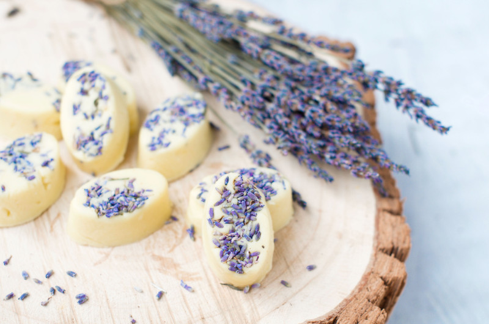
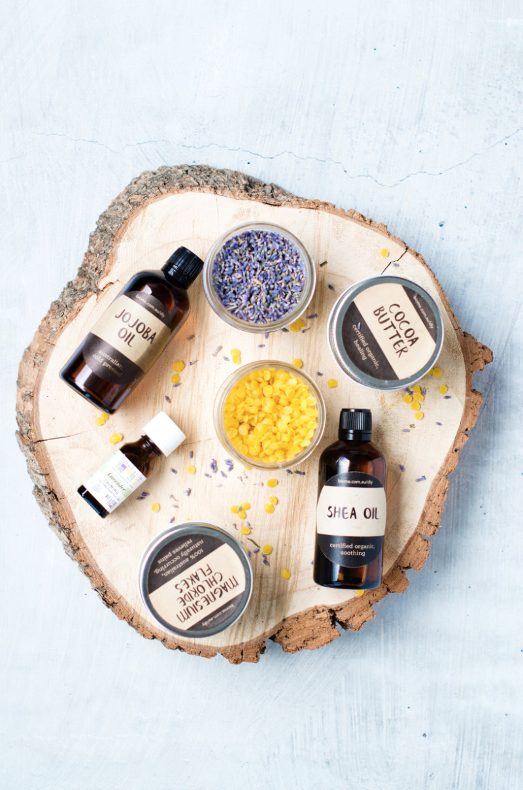
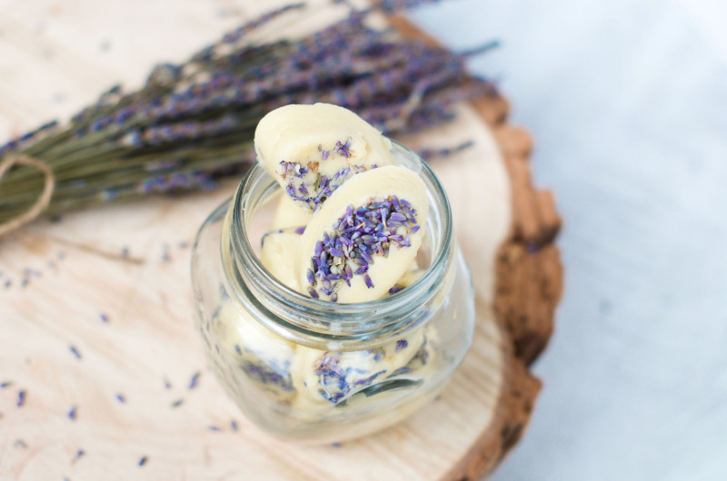
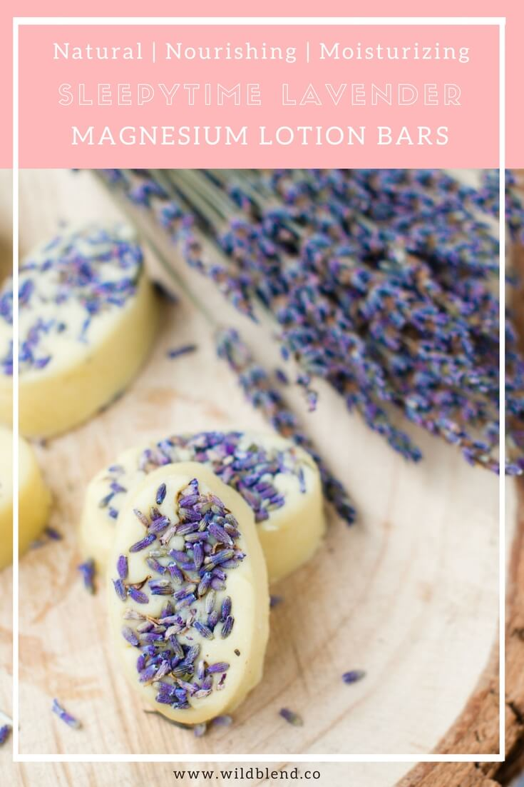

Can't sleep? Sore muscles? Dry skin? These Magnesium Lotion Bars are a cure-all. Nourishing cacao butter, shea, and jojoba oil moisturize and pamper your skin while magnesium chloride relaxes your tired muscles. Massage your aching muscles before bedtime for a restful sleep. These bars will literally melt on your skin and leave your skin feeling hydrated and smooth.

These Magnesium Lotion Bars are a **triple treat**, they:

- soften and moisturize thirsty skin
- help you fall asleep
- replenish tired muscles with magnesium

**Tip:** Add one bar to your bath water (they'll melt) for an extra nourishing and relaxing treat in the evening. Or you can give them to friends and family as a gift (everyone loves homemade gifts). I keep mine on my bedside table to rub on hands and feet before bed.

These natural lotion bars are chemical-free and can be made in different scents with whatever your go-to essential oil preference is. I personally love rose geranium, lemongrass and sweet orange essential oil. Adding dried lavender isn’t necessary but it is a fun way to make your bars look pretty.

\[thrive\_leads id='1525'\]

## Lavender and Magnesium Lotion Bars Benefits

**Magnesium** helps release muscle tension, replenish magnesium storage, improve sleep and make you feel relaxed.

**Lavender** improves sleep, reduces stress, and relieves pain.

**Beeswax** binds all the ingredients together and makes sure they stick to your skin, so the oils and butters soak in.

**Cocoa Butter** softens and soothes skin, heals dry and damaged skin and prevents dryness and irritation.

**Shea Oil** contains Vitamin E, moisturizes dry and flaky skin**,** prevents cracked heals, and reduces inflammation.

**Jojoba Oil** promotes skin health, promotes healing and balances sebum production.

You can get all DIY skincare ingredients online ([here](https://t.cfjump.com/52650/t/14846?Url=https%3a%2f%2fwww.biome.com.au%2f992-diy-skin-care)) or in store at Biome Australia.

These Magnesium Lotion Bars are perfect as massage bars before bedtime or after a strenuous workout. Your muscles will thank you. I like to rub them into my damp skin straight after a long hot shower for further relaxation. They also work wonders on itchy and dry patches on your elbows and knees for some extra TLC. I suggest storing them in an airtight container (mason jar) in the fridge.

If you love DIY skincare, you might also like my [All Natural Whipped Body Butter Recipe](https://www.wildblend.co/whipped-body-butter/).

\[tasty-recipe id="2006"\]

* * *

This post contains affiliate links, meaning, at no additional cost to you, if you click through and make a purchase, I may receive a commission.
