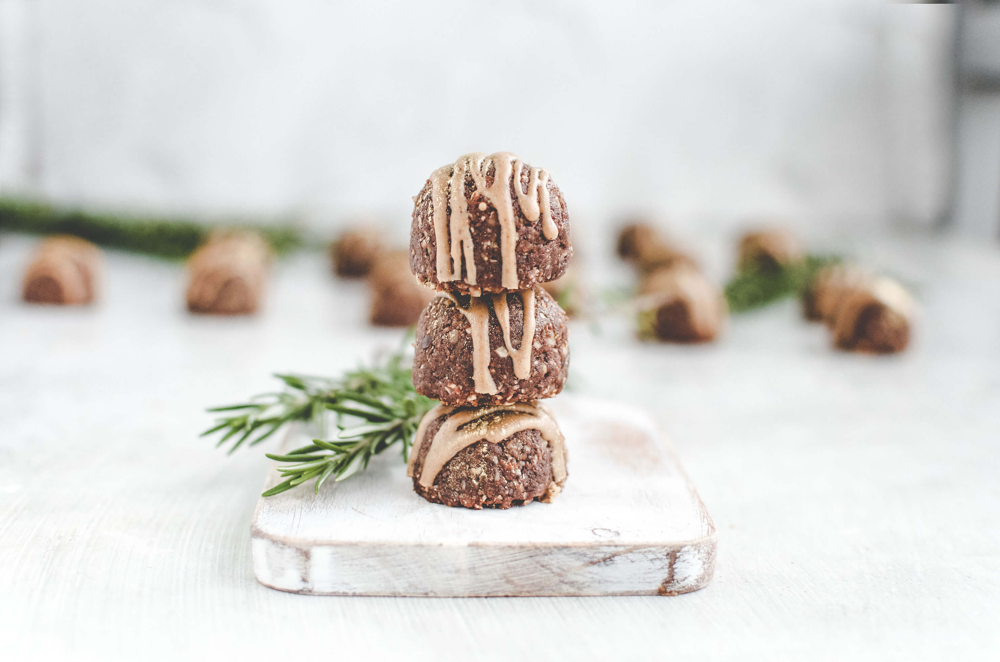
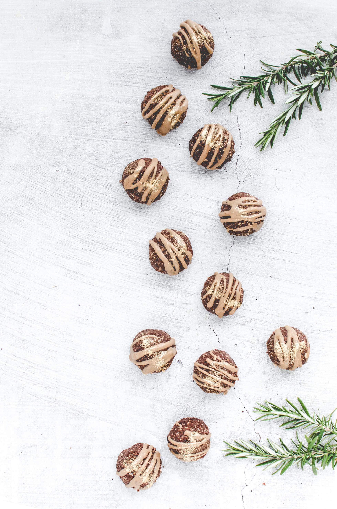
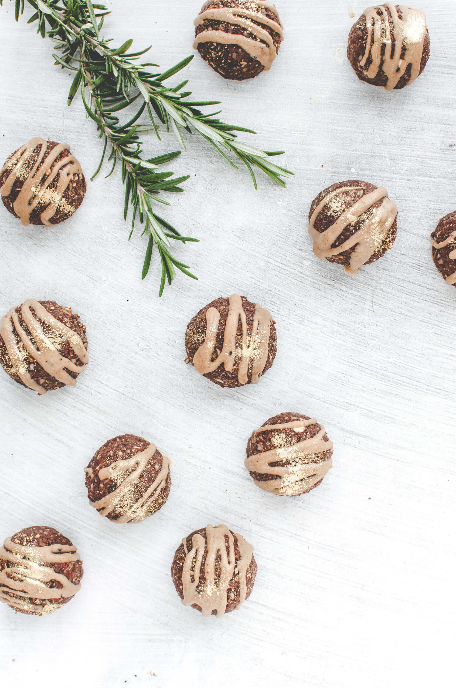
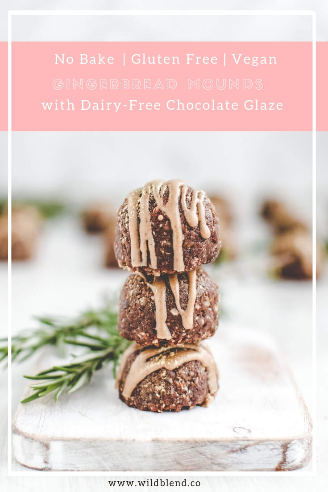

Gingerbread spice is the ultimate Christmas flavour and gingerbread cookies are a must when the holidays roll around. These delicious golden gingerbread mounds taste just like gingerbread men but are much easier to make and don't require any baking. This healthy Christmas recipe is dairy-free, gluten-free and vegan friendly.

Growing up, my family always struggled to make the perfect gingerbread cookie. Our gingerbread men always came out either too dry or too soggy (or they spread like crazy and turned into gingerbread sumo wrestlers lol)—we clearly didn't have Elf baking skills.

These no-bake gingerbread mounds are filled with warm Christmassy spices that will make you feel all warm and fuzzy inside. The best part, they come together in a food processor and don’t require any baking. Start by adding all the dry ingredients to a processor and pulsing until they are well combined. Then, add the wet ingredients and pulse until a sticky cookie dough forms. Use your hands (or a cookie dough scoop) to roll the dough into little mounds. Place them in the freezer while you prepare the glaze.

\[thrive\_leads id='1525'\]

I used [Loving Earth salted caramel chocolate](https://m.lovingearth.net/our-products/chocolate-15/salted-caramel-chocolate.html) and gingerbread spice for a quick and simple glaze. Salty caramel and spicy ginger combined will tickle your taste buds and make you wonder why you haven’t tried this sensational flavour combo before.

These No-Bake Gingebread Mounds are the perfect vegan addition to any traditional cookie platter and will satisfy even the pickiest of eaters. Soon, everyone will be asking for more. I sprinkled mine with a splash of edible gold glitter to make them extra festive, —after all, it’s Christmas! Just wait, the little flecks of gold will sparkle when they catch the light of the Christmas tree candles. Enjoy!

If you love no-bake Christmas recipes, you might also like my [Healthy Christmas Fudge Pinecones.](https://www.wildblend.co/fudge-pinecones/)

\[tasty-recipe id="2210"\]
