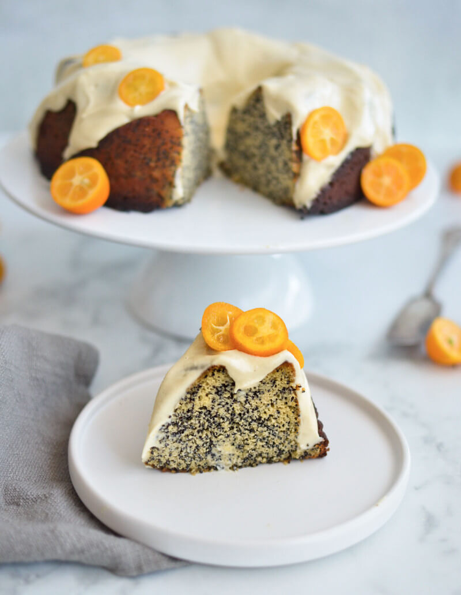
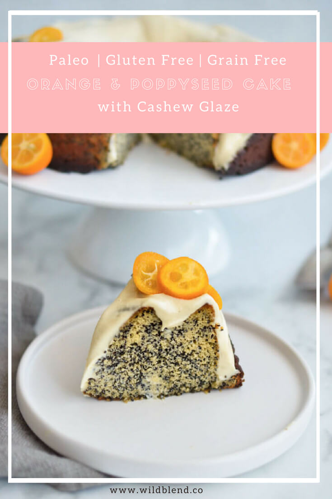

This orange and poppy seed bundt cake is made with almond flour and poppy seeds to keep it gluten-free and grain-free. Once baked until golden brown, the cake is topped with a dairy-free cashew glaze bursting with citrus flavour. Trust me, you won’t believe how healthy it actually is until you see how short the ingredient list is—It tastes that decadent and indulgent!

Other than most bundt cakes, this orange and poppy seed cake is very moist and fluffy. Almond flour, vanilla and date paste add a wonderful marzipan flavour to this poppy seed bundt cake but it is the addition of refreshing citrus and crunchy poppy seed which make it absolutely irresistible. You'll find yourself coming back for more many times. I had to literally hide this cake from my husband or he would've eaten it all in one day.

\[thrive\_leads id='1525'\]

To bring this cake together, simply add all wet ingredients into a food processor and pulse until incorporated. In a separate bowl, combine all dry ingredients and gradually stir them into the wet ingredients. The glaze is a simple mix of  soaked cashews, coconut oil, and maple syrup—spiced with orange juice and a splash of Cointreau (which is optional).

This poppy seed bundt cake will quickly become one of your go-to favourites because it is:

- gluten-free
- fluffy
- Paleo-friendly
- easy-to-make
- moist
- citrusy

Enjoy this orange and poppy seed bundt cake with your morning tea or as an afternoon pick-me-up!

\[tasty-recipe id="2064"\]
