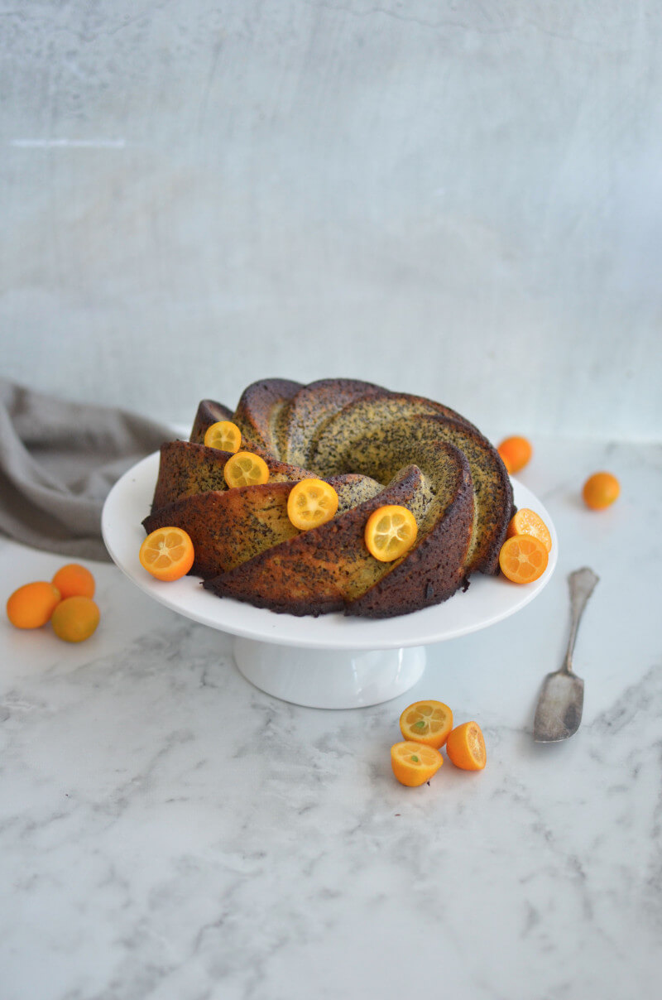

This orange and poppy seed bundt cake is made with almond flour and poppy seeds to keep it gluten-free and grain-free. Once baked until golden brown, the cake is topped with a dairy-free cashew glaze bursting with citrus flavour. Trust me, you won’t believe how healthy it actually is until you see how short the ingredient list is—It tastes that decadent and indulgent!

Other than most bundt cakes, this orange and poppy seed cake is very moist and fluffy. Almond flour, vanilla and date paste add a wonderful marzipan flavour to this poppy seed bundt cake but it is the addition of refreshing citrus and crunchy poppy seed which make it absolutely irresistible. You'll find yourself coming back for more many times. I had to literally hide this cake from my husband or he would've eaten it all in one day.

\[thrive_leads id='1525'\]

To bring this cake together, simply add all wet ingredients into a food processor and pulse until incorporated. In a separate bowl, combine all dry ingredients and gradually stir them into the wet ingredients. The glaze is a simple mix of  soaked cashews, coconut oil, and maple syrup—spiced with orange juice and a splash of Cointreau (which is optional).

This poppy seed bundt cake will quickly become one of your go-to favourites because it is:

- gluten-free
- fluffy
- Paleo-friendly
- easy-to-make
- moist
- citrusy

Enjoy this orange and poppy seed bundt cake with your morning tea or as an afternoon pick-me-up!

[Print](http://localhost:10003/orange-poppy-seed-bundt-cake/print/2064/)

## Orange And Poppy Seed Bundt Cake

This decadent Orange and Poppy Seed Bundt Cake is made with gluten-free almond flour and topped with a dairy-free cashew glaze bursting with citrus flavour.

- **Author:** Zoe
- **Prep Time:** 20 minutes
- **Cook Time:** 35 minutes
- **Total Time:** 55 minutes
- **Yield:** 1 cake 1x

### Ingredients

Scale 1x2x3x

**For the cake:**

- 1 large peeled whole orange, chopped
- 3 eggs
- 1/2 cup date paste
- 2 cups almond flour
- 1.5 cups poppy seeds
- 2 tsp gluten free baking powder
- 1 tsp vanilla

**For the glaze:**

- 2 cups raw cashews, soaked overnight and rinsed
- 2 Tbsp coconut oil, melted
- 3 Tbsp maple syrup
- 1 tsp vanilla
- 1/2 cup fresh orange juice
- 2–3 tsp Cointreau (optional)
- 1–2 Tbsp water, as needed for blending

### Instructions

1. For the cake, place orange, eggs, date paste and vanilla to a high-speed blender or food processor and blend until smooth and creamy.
2. In a bowl, combine the almond flour, poppy seeds and baking powder.
3. Add the orange and egg mixture to the flour and mix well until fully combined.
4. Pour the batter into a greased bundt cake pan.
5. Bake for 35 minutes at 175 – 180°C (fan-forced).
6. For the glaze, add all ingredients a to a high-speed blender or food processor and blend until smooth and creamy.
7. Add 1-2 tablespoons of water to create a slightly runnier glaze or omit the water if you would like a thick glaze.
8. When ready to serve, spread glaze over cake, slice and enjoy immediately.

### Notes

**Tip:** It’s best to let cake cool down, before applying the glaze.

### Did you make this recipe?

Share a photo and tag us — we can't wait to see what you've made!

