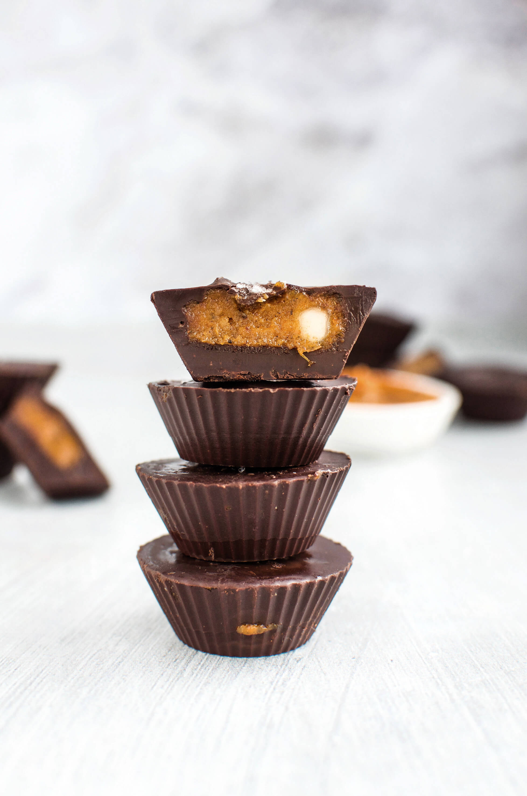
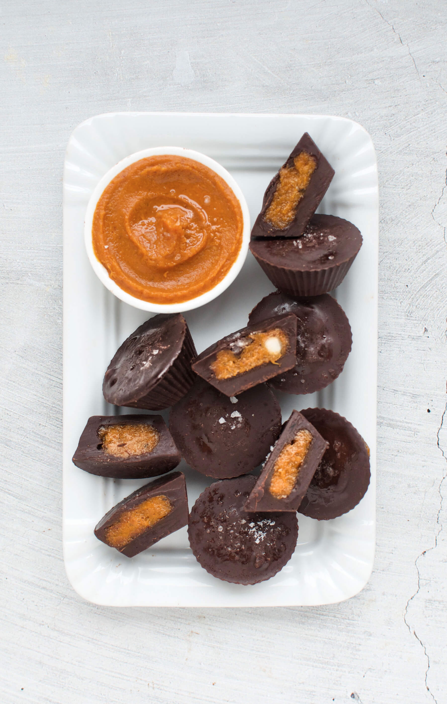
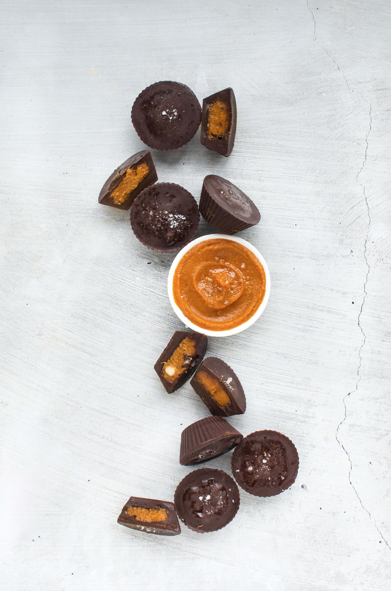
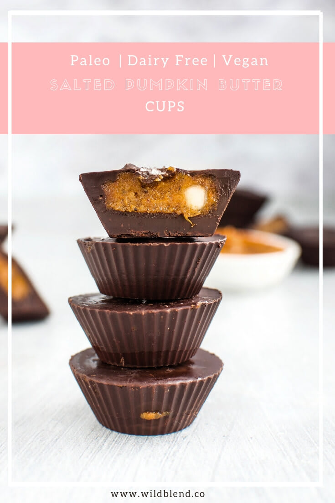

Forget pumpkin lattes and store-bought candy bars and make these easy, no-fuss treats ASAP. They'll  become your new favourite autumn recipe. Growing up in Austria, pumpkin spiced treats weren't actually a huge part of my childhood. I've only recently discovered the world of pumpkin spice and decided to combine two beautiful things: Reese's Peanut Butter Cups and Pumpkin Spice. I hope you'll enjoy the result as much as my family.

Most fall-flavoured recipes have one thing in common... sugar! Lattes, candy bars and Co. are usually sugar-laden and more naughty then nice. My take on autumn-y Reese's Cups is only sweetened with a half teaspoon of maple syrup and requires minimal ingredients. I personally don't like recipes with a long ingredient list and always try and keep my own recipes short and simple.

You can make these Pumpkin Butter Cups entirely from scratch using coconut oil, cacao butter, cacao powder and maple syrup to make the chocolate for the cups in place of the dairy-free chocolate. If you have time to make your own chocolate, go for it. It's simple and tastes just as good. I used Loving Earth [dark organic chocolate](https://m.lovingearth.net/our-products/chocolate-15/85-dark-chocolate.html) which I buy in bulk from [Source Bulk Foods](https://thesourcebulkfoods.com.au/).

\[thrive\_leads id='1525'\]

The filling comes together by combining pumpkin puree and macadamia nut butter. If you don't have macadamia nut butter or it's too expensive where you live, simply swap if for cashew butter. I don't recommend using almond or peanut butter as the flavour will be too rich and overpower the beautiful pumpkin flavour. The fat in the macadamias highlights the pumpkin flavour and complements it's sweetness. You can entirely omit the maple syrup if you're trying to reduce sweetener (or are on a keto diet). I only added it to enhance the fall-flavour.

One of the reasons why I love these Pumpkin Butter Cups is that they come together in no time. Once you've poured the chocolate over the filling, place them in the fridge and they'll harden immediately. I store my cups in an airtight container in the fridge to keep them from melting. However, they usually don't last very long.

\[tasty-recipe id="2116"\]
