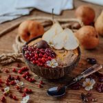

Today I’d like to introduce you to an amazing blogger friend from my home country Austria. Her name is Carina [@carinaberry](https://www.instagram.com/carina_berry/) and she’s Austria’s biggest fitness blogger. Carina is not only an amazingly talented blogger, recipe writer and food photographer but she’s also a sweet soul who loves to travel as much as I do. I met Carina on Instagram and will hopefully catch up with her in the real world on one of my home visits next year. Carina has developed her own [food blogging online program](https://instant-instagram-growth.teachable.com/p/food-blogging-success/) that you should check out if you want to learn how to take pretty photos like her.

She’s currently on a 2.5-month trip around South and Middle America with her boyfriend and speaks five languages fluently (crazy right)! Be prepared for some serious language envy when you watch her stories as she effortlessly switches from speaking English to German to French to Spanish and Italian. As I’m gearing up for my own around-the-world trip I’m constantly exchanging travel tips with her. It’s not easy to blog and travel at the same time but Carina makes it look easy. Her suitcase seems to magically contain all these beautiful props and her creations look as if she just whipped them up in her kitchen at home. I have no idea how she does it but I hope I can learn a thing or two from her.

\[thrive_leads id='1525'\]

Carina’s recipes are focused on healthy fitness foods and she specializes in protein-laden breakfasts, clean lunch ideas and healthy desserts. You can also find wonderful Vegan recipes on her [blog](http://carinaberry.com/). Aside from her food blogging online course, Carina has also developed another online course called ‘[Instant Instagram Growth](https://instant-instagram-growth.teachable.com/)’.

Today, Carina is sharing one of her most popular recipes on my blog. Her Pumpkin Spice Porridge is a fall-licious creation that is bound to make its way to your list of favourite breakfasts! Creamy nut butter and pumpkin puree make this breakfast extra creamy. It wouldn’t be a Carinaberry recipe if it wasn’t dairy-free, sugar-free, and protein-rich. She always adds extra protein to her creations to make them fitness-friendly. Without further ado, here’s Carina’s wonderful guest recipe:

## **Guest Post by Carina Berry**

Hi there, I’m Carina from Austria and I am so happy to be able to share my love for healthy food with you today. My blog focuses on clean fitness recipes and I love to inspire people with my active lifestyle. I have a huge sweet tooth and therefore I am always looking for ways of how to turn conventional unhealthy desserts into fitness food! Its so much fun substituting the bad stuff for natural and fresh ingredients and create guilt free recipes in the process. That is why on my blog you will find mostly sweet breakfast recipes and desserts, all without sugar, oil or flour!

Besides my immense passion for cooking I love to workout and be active outside. Also, I love traveling and share this important part of my life with my followers on my blog and Instagram. Currently I am exploring Latin America with my boyfriend, heading to Cancun as we speak. On my trips I love to get inspired by all the wonderful cuisines around the world and let these vibes flow into my recipes. I also brought one of my favorite breakfast recipes with me today. Since it is such a comforting dish for the Christmas season I figured it would be perfect to share with you. I would love to show you how to make my super popular pumpkin spice porridge recipe! Pumpkin is one of my favorite ingredients right now and I put it in almost all of my recipes right now.

## Pumpkin Spice Porridge

For this easy pumpkin porridge you will just need a handful of ingredients. It is super easy to make and will take you only 15 minutes. Regarding the type of pumpkin I only have made it with Hokaido. I like to use this kind of pumpkin because of the beautiful orange color. I am sure the other ones will work fine too. As usual I substituted regular refined sugar with Erythrit to save quite a bit of calories. If you don’t have that at home you can use honey, maple syrup, date syrup or Xylit.

If you would like to add some extra protein this is the perfect opportunity to mix in an extra scoop of your favorite protein. I can recommend using vanilla, but chocolate is also super yummy! 
For vegan fitness versions of this pumpkin porridge I have used hemp protein and sunflower protein in the past and it was also super tasty.

Since this is a hearty and smooth winter/fall composition I would recommend topping it with winter fruit like pears or apples.
 I would also prefer slightly simmered apples or pears instead of raw ones. Like this the flavors evolve better and if you add some cinnamon and honey its just the perfect topping.
When I make it I usually use nut butter as well which adds so much extra delicious flavor to the pumpkin porridge. Another topping I can recommend are nuts. I used very special red nuts that my grandma has in her garden. But regular walnuts, pecans or almonds will do as well. You can find the full recipe and instructions below. Enjoy!

Looking for more healthy breakfast inspo? You might also like my [Grain-Free Cauliflower 'Oatmeal'](https://www.wildblend.co/cauliflower-oatmeal/).

[Print](http://localhost:10003/pumpkin-spice-porridge/print/2148/)

## Pumpkin Spice Porridge


This autumn-inspired pumpkin spice porridge will make you feel all warm and fuzzy inside.

- **Author:** Carina Berry

### Ingredients

Scale 1x2x3x

- 100ml almond milk
- 20g oat flour
- 50g pumpkin puree
- 20g erythrit or xylit
- 1 tsp of pumpkin spice
- 1/2 scoop of protein powder
- nut butter (for topping)
- apples or pears for topping

### Instructions

1. In a pot boil the oats in milk under consistent stirring.
2. Once thickened add in the pumpkin purree, sweetener of choice, protein powder and pumpkin spice.
3. Stir until well combined.
4. Put in a bowl and top with nut butter of choice and apples or pears.

### Did you make this recipe?

Share a photo and tag us — we can't wait to see what you've made!

---

I hope you enjoyed this recipe and guest post. If you end up making it make sure to tag Zoe and me in your post or story. We would love to see what you came up with. Also, if you are looking for more healthy breakfast/dessert recipes make sure to head over to my [Instagram](https://www.instagram.com/carina_berry/?hl=en) and [blog](http://carinaberry.com/) to have a look.

All the best! Carina
