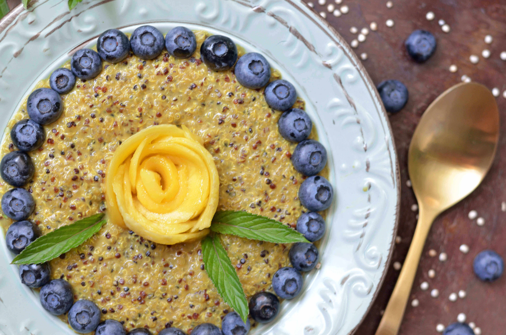
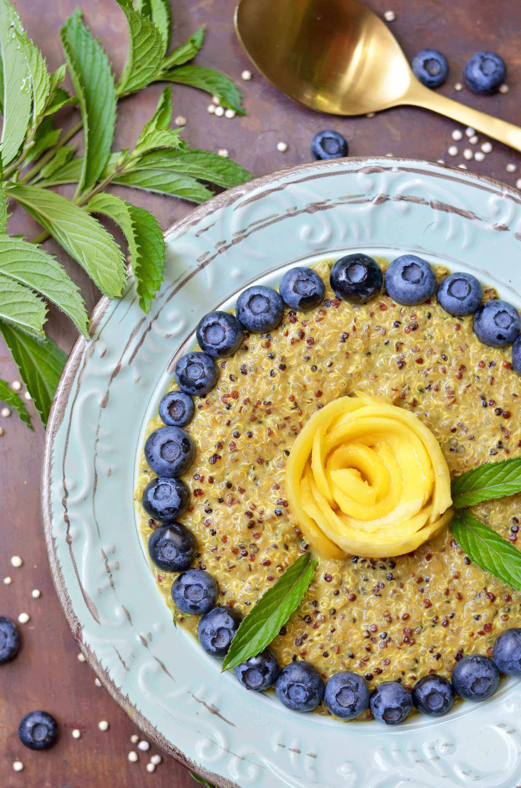
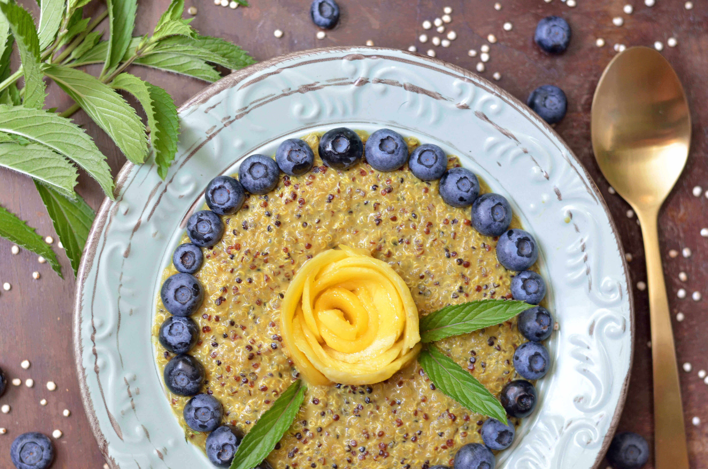
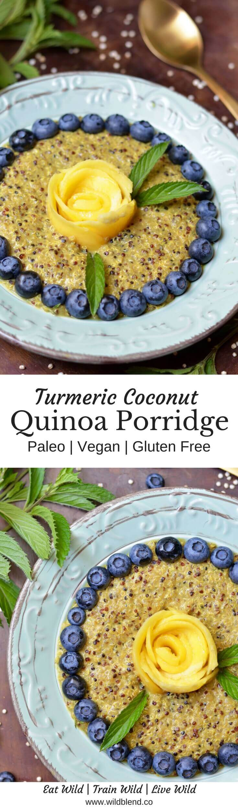

Fancy a wheat-free start to the day that's healthier and just as satisfying as classic oats? This Quinoa Coconut Porridge is a great alternative to breakfast oatmeal. Quinoa has quite the nutritional powerhouse reputation. Full of muscle building, metabolism boosting protein, it’s also gluten free, low in calories and packed full of other essential vitamins and minerals. It's a weightloss-friendly alternative that you should add to your breakfast repertoire if you're looking for more healthy options.

Coconut milk adds a creamy tropical twist to this porridge and makes it suitable for vegans (or lactose intolerant). The fatty acids in coconut milk may aid weight loss, benefit your metabolism and heart health. Turmeric and Maca powder add plenty of flavour and immunity-boosting as well as anti-inflammatory properties to this power breakfast.

Every good porridge needs some form of liquid to bring all the flavors together. Coconut milk is my favourite but you can choose any other plant-based milk you like.

Replace coconut milk with any of these liquids:

- Almond milk
- Cashew milk
- Hemp milk
- Rice milk

\[thrive_leads id='1525'\]

Superfoods and spices can make a difference between a bland and a tasty porridge. Add any combination of your favorite seasonings (if you don't like turmeric and maca), or use these suggestions for extra flavour.

- Lucuma powder, dates and vanilla
- Cinnamon, cardamon, nutmeg, and ginger
- Cacao and peanut butter
- Cinnamon and raisins
- Cacao nibs
- Egg white (stir in while cooking for some extra protein)
- Stir through some veggies like grated zucchini, pumpkin or sweet potato puree

Lastly, top your porridge with your favourite nuts, seeds, and fruit to brighten up your breakfast even more. Turmeric and mango are a great combination but here are some other ideas for tasty toppings.

Add Extra Toppings:

- Walnuts
- Almonds
- Hazelnuts
- Cacao Nibs
- Hemp hearts
- Ground flaxseed
- Chia seeds
- Granola
- Coconut flake**s**
- Blueberries
- Raspberries
- Banana

[Print](http://localhost:10003/quinoa-coconut-porridge/print/1620/)

## Quinoa Coconut Porridge with Turmeric

This healthy breakfast swaps oats for low-GI and gluten-free quinoa for a super-satisfying and warming start to the day!

- **Author:** Zoe
- **Prep Time:** 20
- **Cook Time:** 10
- **Total Time:** 30
- **Yield:** serves 2 1x

### Ingredients

Scale 1x2x3x

- 1.5 cups cooked tricolor quinoa
- ¾ cups organic full-fat coconut milk (plus a little more to serve)
- 1 tsp maca powder
- 1 tsp ground turmeric
- 2 tsp maple syrup (or liquid sweetener of your choice)

### Instructions

1. Rinse quinoa under cold running water.
2. Bring the cooked quinoa and coconut milk to a boil and simmer on medium heat for 5 minutes.
3. Add maca, turmeric and sweetener and simmer for 5 more minutes.
4. Transfer porridge into a bowl and serve with fresh mango, blueberries or banana slices.
5. Add extra coconut milk if desired.

### Did you make this recipe?

Share a photo and tag us — we can't wait to see what you've made!

