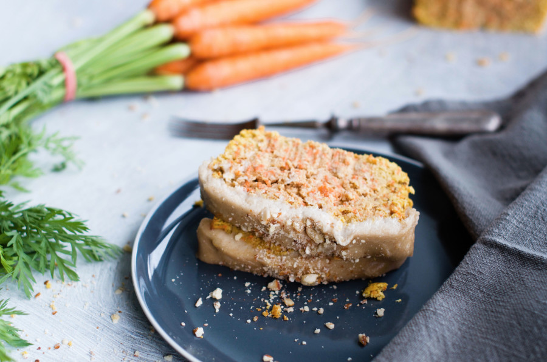
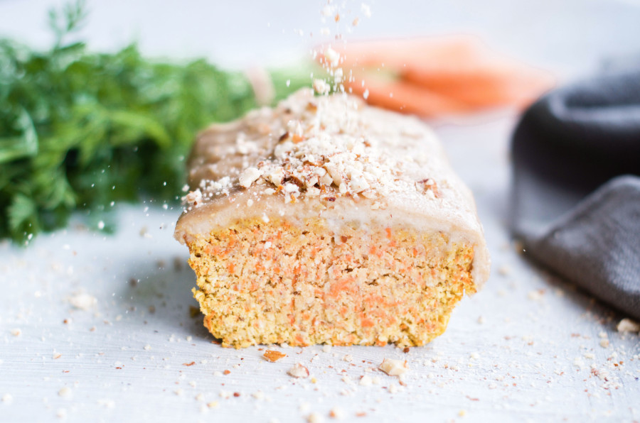
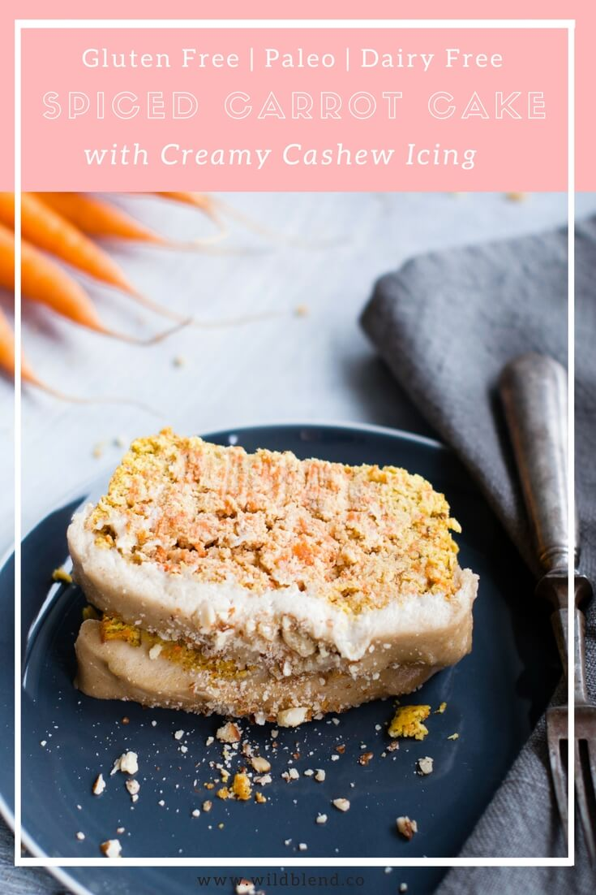

Easter is just around the corner and a carrot cake without dairy and gluten is a must! I love carrot cake but it's hard to find a recipe that is not loaded with cream cheese and tons of sugar. This spiced coconut carrot cake recipe combines desiccated coconut, grated carrots and almond flour for a healthier, better-for-you version.

This Paleo-friendly spiced carrot cake will surely satisfy any cravings. It’s moist and filled with warming spices such as cinnamon, ginger, nutmeg, cloves. It's packed with carrots and bursting with orange zest for a citrusy punch—everything you want from a carrot cake right?

\[thrive\_leads id='1525'\]

I've swapped traditional cream cheese frosting for a lighter, dairy-free cashew cream frosting infused with freshly grated orange zest. Trust me, it's hard to not eat the frosting by itself! Not an orange fan? You could flavour your frosting with lemon or lime in place of orange. Anything goes. On a different note, a chai-infused cashew frosting could be a nice winter twist (if you make this recipe during the holidays).

This loaf pairs well with a big cup of tea or coffee and tastes best chilled. I always let the cashew frosting set in the fridge before I serve it. You could add some raisins or even pineapple chunks to the batter but be sure the cake doesn't get too moist or it will crumble. No matter how you spice it, this cake is everything you love about carrot cake and more—it's:

- Paleo
- refined sugar-free
- dairy-free
- grain-free
- gluten-free
- healthy
- moist
- citrusy

 

If you love spiced carrot cake, you might also like my my [No-Bake Carrot Cake Protein Slice](https://www.wildblend.co/carrot-cake-protein-slice/).

\[tasty-recipe id="1977"\]
