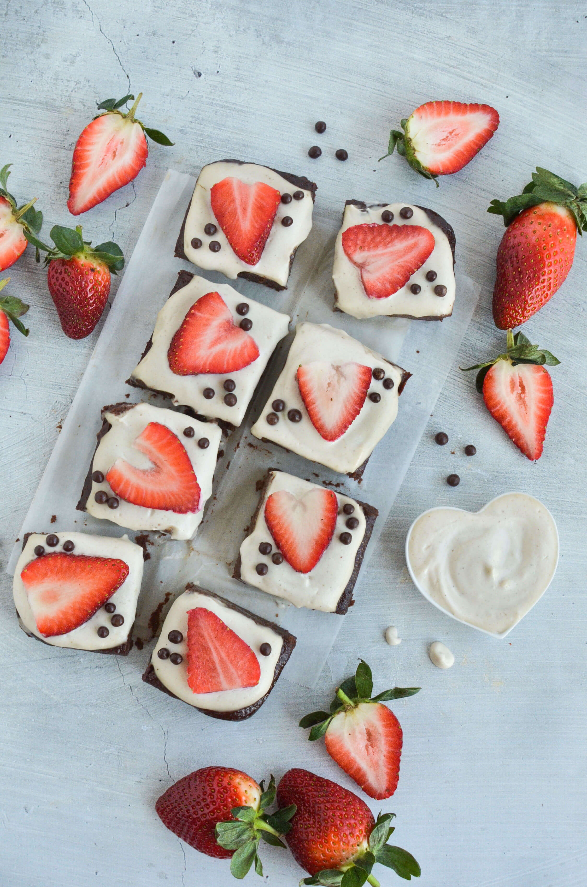
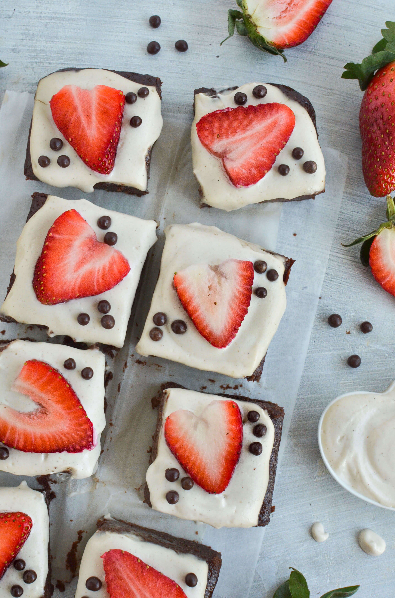
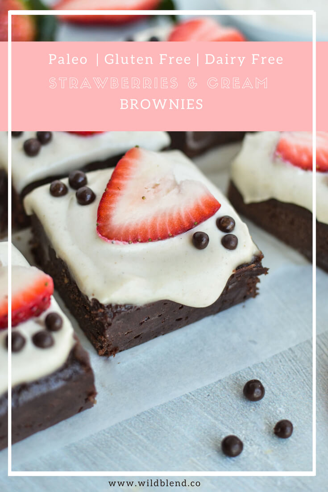

I love simple recipes. If you've been to this blog before, you've probably noticed that most of my recipes have 10 or less ingredients, and are blender or one-bowl recipes because I like to keep it simple. This Strawberries and Cream Brownie recipe is no exception. I used minimal ingredients while still keeping it gluten-free, dairy-free and flourless.

A lot of Paleo-friendly recipes use an intricate mix of different starches and nut flours to hold together. Fear not, these brownies are the complete opposite of complicated. I used applesauce and dates to make them extra fudgey and moist. Raw cacao powder adds antioxidants, iron and magnesium to this chocolately treat (Yes, chocolate is good for you).

\[thrive\_leads id='1525'\]

The dairy-free cashew cream frosting is the icing on the cake ehm brownie. I dare you, not to eat it by itself because I certainly can't keep myself from licking the spoon. It's a spin off from my orange cashew glaze I used for my [orange and poppy seed bundt cake recipe](https://www.wildblend.co/orange-poppy-seed-bundt-cake/). The frosting comes together in a high-speed blender like a Vitamix. No other tools needed.

Most brownies I've tried in cafe's are a bit dry and powdery because they use too much flour. I like my brownies gooey, fudgey and moist. These Strawberries and Cream Brownies literally melt in your mouth. I promise, you don't even have to chew to enjoy them haha. If you love chocolate, you'll love them as much as I do.

\[tasty-recipe id="2084"\]
