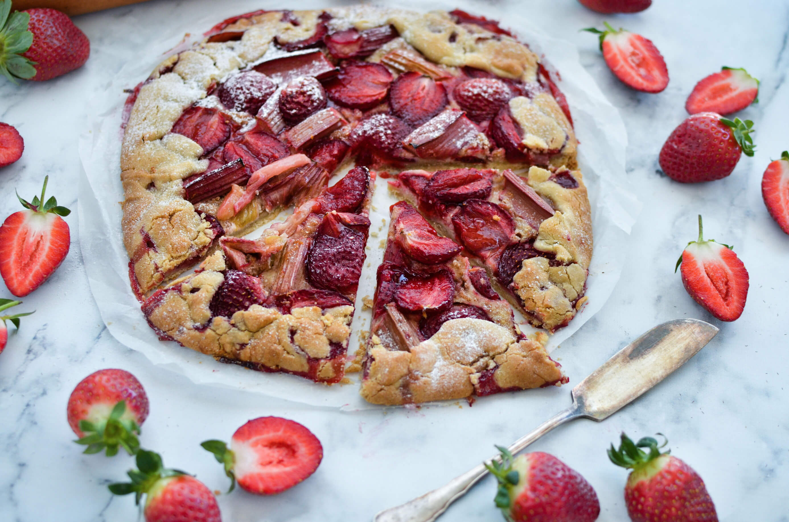
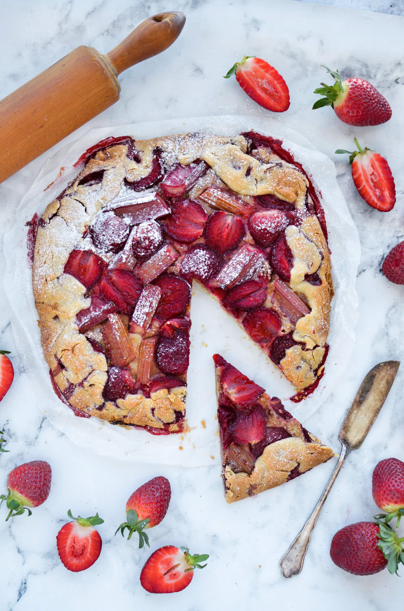
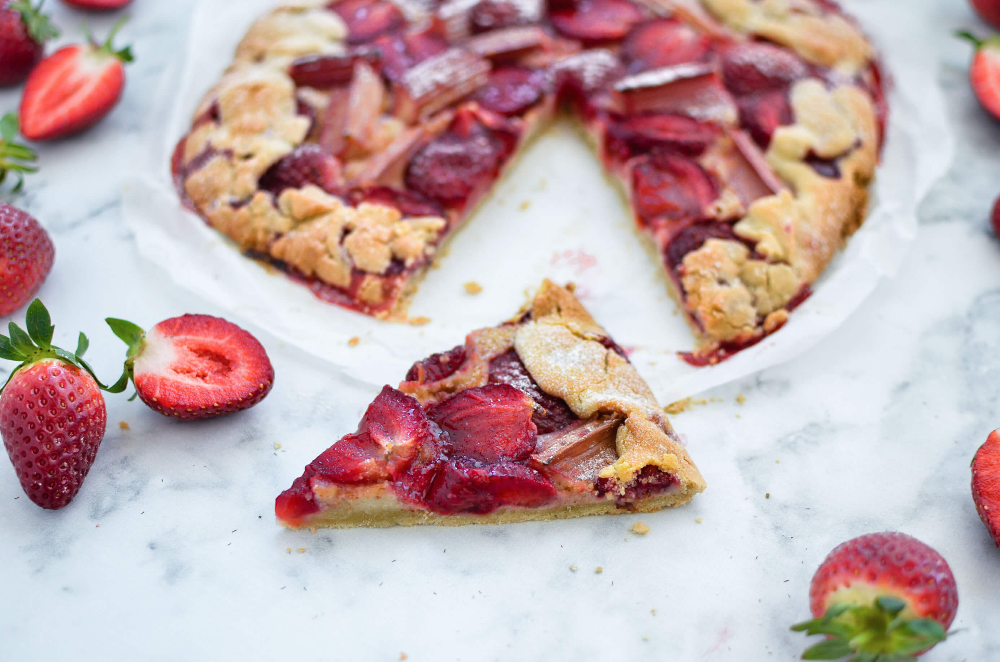
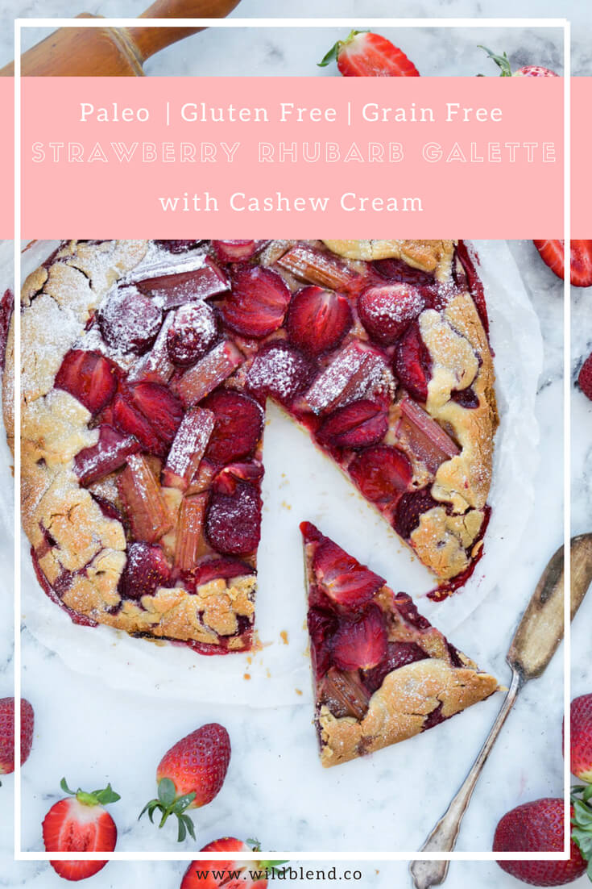

If you're a strawberry fan, you need to try this strawberry rhubarb galette ASAP! Berry season is hands down one of my favourite times of the year. I used to go berry picking in my mum's garden as a child and still get really excited when berries are in season. Instead of my mum's garden, I now go to [Queensland Strawberries Farms](https://www.qldstrawberries.com.au/) to pick fresh berries straight from the farm.

Strawberries are one of my favourite berries because they are so versatile and really fun to cook and bake with. For this rhubarb strawberry galette, I combined them with tart rhubarb (also a season favourite) and sweet cashew cream.

\[thrive\_leads id='1525'\]

The best part, galettes are the simplest of all tarts. They don't have to be symmetrical or super pretty. You simply roll out the dough into a semi-round shape, add your favorite fruit filling, and fold over the edges. That's it, as if that's not reason enough to break out the strawberries and get baking.

I like rolling my dough between two sheets of parchment paper for easier handling (no sticking to your hands, kitchen bench or rolling pin). Another tip is to try and keep the dough and equipment as cool as possible to keep the dough from sticking to everything. I chill my dough for 30 minutes before I roll it out and again before I put the galette into the oven.

I love this classic sweet tart combination of rhubarb and strawberry. The sweet cashew cream keeps it deliciously dairy-free and Paleo friendly. It's best served still warm from the oven with a generous scoop of coconut ice cream, whipped coconut cream or leftover cashew cream.

If you'd like to find out more about the strawberries I used in this recipe, please visit [Queensland Strawberries](https://www.qldstrawberries.com.au/).

\[tasty-recipe id="2053"\]
