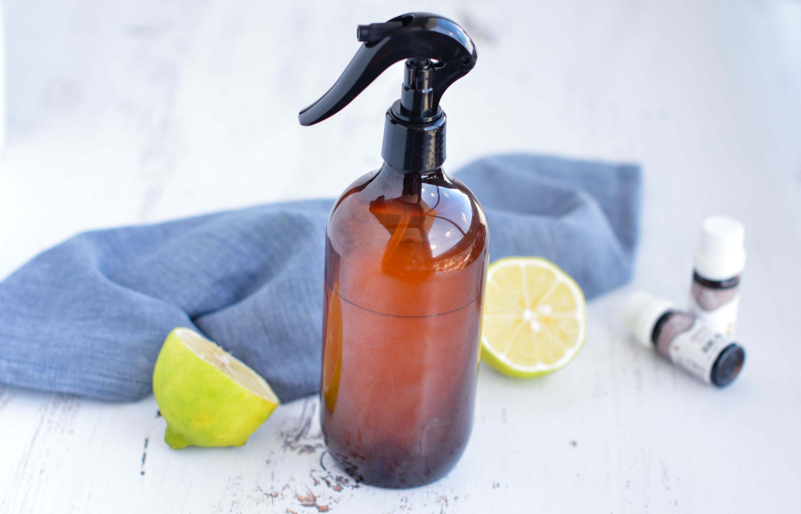
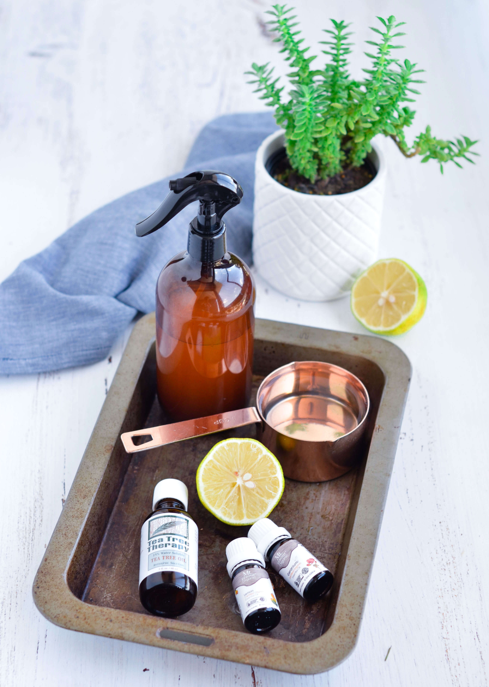
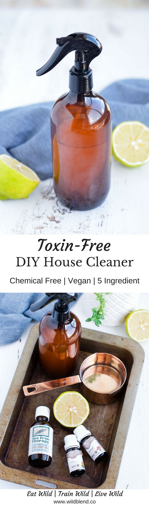
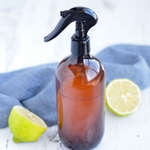

Trying to be waste-free has many beneficial side effects. You'll create less waste, save money, become a more conscious consumer and steer clear from harmful chemicals hiding in conventional cleaning products. This homemade toxin-free house cleaner will make your kitchen and bathroom shine–all without harmful chemicals.

Most store-bought cleaning products (especially spray bottles) contain harmful chemicals classified as hazardous air pollutants that can lead to liver and kidney damage. Give your liver a break and make this make this toxin-free house cleaner instead–for a fraction of the cost. Plus, you probably already have the ingredients for this easy DIY recipe on hand.

\[thrive_leads id='1525'\]

White vinegar is a common household cleaning staple due to it's great antibacterial properties. Not only is vinegar inexpensive but it is also very effective at breaking down molds, grease, and bacteria. I love using essential oils for cleaning because the smell amazing and are a natural way to keep mold and bacteria out of your home. I personally try to stay away from chemical cleaning products as much as possible and trust natural products.

[Tea tree oil](https://t.cfjump.com/52650/t/14846?Url=https%3a%2f%2fwww.biome.com.au%2fessential-oils%2f17296-mt-retour-essential-oil-tea-tree-9324525090607.html) is well-known for it's powerful antibacterial, antimicrobial, antiseptic properties—which makes it the perfect addition to any house cleaner. [Lemon oil](https://t.cfjump.com/52650/t/14846?Url=https%3a%2f%2fwww.biome.com.au%2fessential-oils%2f17323-mt-retour-essential-oil-lemon-9324525090201.html) is cleansing, purifying, and adds shine to windows and counter tops.

To make this toxin-free house cleaner you'll need a glass or plastic spray bottle, measuring cup and funnel. Simply combine white vinegar, water and essential oils in a bottle, secure the lid and shake it up. That's it! You can basically use any essential oils of your choice. I recommend using some of the best essential oils for cleaning:

- lemongrass
- cinnamon
- clove
- eucalyptus
- grapefruit
- lime
- oregano
- rosemary
- thyme

If you love chemical-free DIY projects, you might also like my [All-Natural Whipped Body Butter](https://www.wildblend.co/whipped-body-butter/).

[Print](http://localhost:10003/toxin-free-house-cleaner/print/1921/)

## DIY Toxin-Free House Cleaner

This DIY toxin-free all-purpose house cleaner is made with all natural ingredients and can be used for counter tops, windows or bathrooms!

- **Author:** Zoe
- **Prep Time:** 5 mins
- **Total Time:** 5 minutes

### Ingredients

Scale 1x2x3x

- 1 cup white vinegar
- 1 cup water
- 10 drops [tea tree essential oil](https://t.cfjump.com/52650/t/14846?Url=https%3a%2f%2fwww.biome.com.au%2fessential-oils%2f17296-mt-retour-essential-oil-tea-tree-9324525090607.html)
- 15 drops [lemon essential oil](https://t.cfjump.com/52650/t/14846?Url=https%3a%2f%2fwww.biome.com.au%2fessential-oils%2f17323-mt-retour-essential-oil-lemon-9324525090201.html)
- 5 drops [geranium oil](https://t.cfjump.com/52650/t/14846?Url=https%3a%2f%2fwww.biome.com.au%2fessential-oils%2f17322-mt-retour-essential-oil-geranium-9324525090096.html) (optional, for scent)

### Instructions

1.  Combine all of the ingredients in a glass bottle, secure lid and shake it up.
2.  Spray on household surfaces as needed.
3.  Shake before each use to incorporate the essential oils.
4.  To use, spray any areas that need to be cleaned, rinse well, and wipe dry.

### Did you make this recipe?

Share a photo and tag us — we can't wait to see what you've made!

