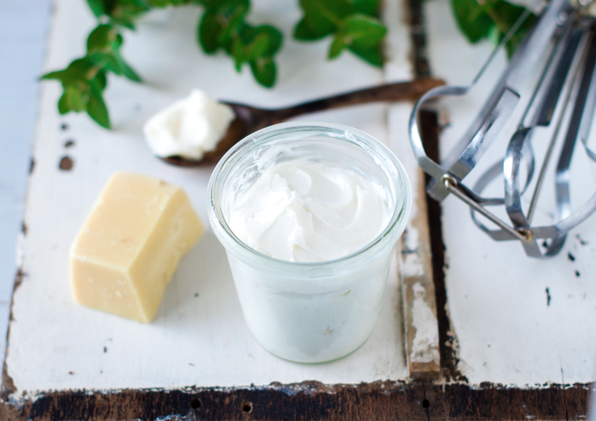
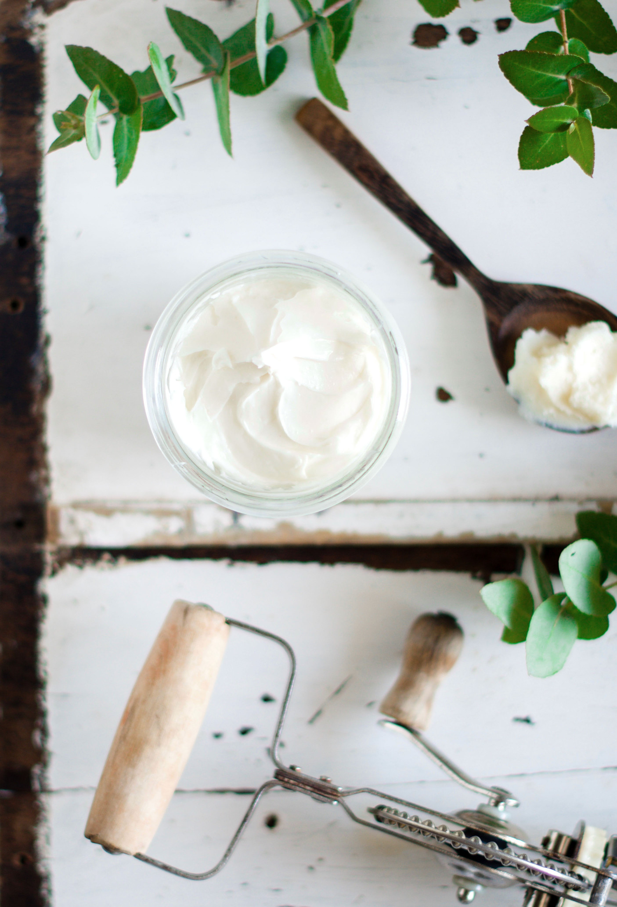
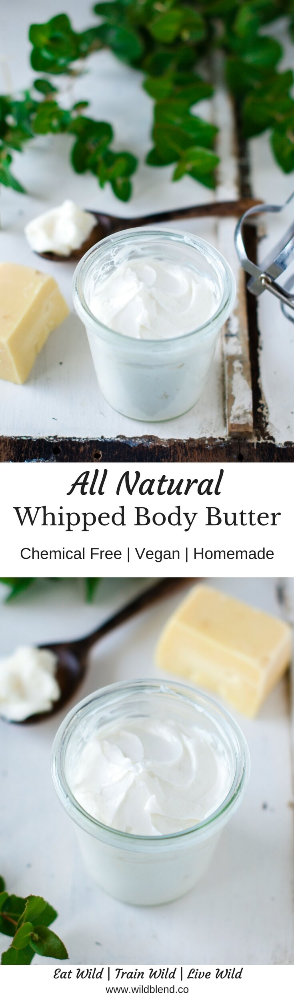
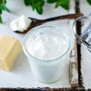

It's a great homemade gift that everyone will appreciate because it looks a lot harder than it actually is. You know how sometimes you see a recipe and think it's way too complicated. This whipped body butter recipe is different! Don't shy away from working with essential oils and ingredients you've never used before. I can guarantee you, it's so much easier than you think.

Creating your own skincare will not only save you money and keep your skin healthy but it will also help to reduce waste and shrink your eco-footprint. I'm currently participating in a 30-day zero-waste challenge and making my own skincare is one of many ways to reduce waste. The challenge is all about focusing on simple, organic living, real food, and waste reduction—if you want to learn more about a zero-waste lifestyle, be sure to follow my Instagram stories where I share daily updates of my waste-free journey.

## DIY Body Butter

Homemade body butter is made by combining butters (solid) with carrier oils (liquid) and essential oils (to scent).

Butters:

- [Shea butter](https://t.cfjump.com/52650/t/14846?Url=http%3a%2f%2fwww.biome.com.au%2fdiy-skin-care%2f16946-shea-butter-in-jar-50g.html)
- Cacao butter
- [Mango Butter](https://t.cfjump.com/52650/t/14846?Url=http%3a%2f%2fwww.biome.com.au%2fliquids-oils-butters-wax%2f18576-mango-butter-certified-organic-in-glass-jar-50g.html)

Carrier oils:

- Sweet almond oil
- Hemp seed oil
- Avocado oil
- Apricot seed oil

Essential oils (optional):

- [Sweet orange](https://t.cfjump.com/52650/t/14846?Url=https%3a%2f%2fwww.biome.com.au%2fessential-oils%2f6395-mt-retour-organic-essential-oil-sweet-orange-9324525092106.html)
- Lavender
- [Geranium](https://t.cfjump.com/52650/t/14846?Url=https%3a%2f%2fwww.biome.com.au%2fessential-oils%2f17322-mt-retour-essential-oil-geranium-9324525090096.html)
- Frankincense
- [Ylang Ylang](https://t.cfjump.com/52650/t/14846?Url=https%3a%2f%2fwww.biome.com.au%2fessential-oils%2f17326-mt-retour-essential-oil-ylang-ylang-9324525090133.html)
- peppermint

You want to choose raw, cold-pressed butters and oils – free of chemicals that are used in bleaching and refining. If you prefer unscented body butter simply omit the essential oils. You can get a range of natural, raw skin care ingredients needed to make beautiful body scrubs, face masks, body butter and much more at [Biome](https://t.cfjump.com/52650/t/14846?Url=https%3a%2f%2fwww.biome.com.au%2f992-diy-skin-care).

\[thrive_leads id='1525'\]

To start off, you want to melt down the solid butters in a double boiler until completely liquefied. Once the butter is melted, let it cool down before you add the carrier and essential oils. Cover the container with a lid or tea towel before you place it in the freezer to set. Leave in the freezer until the butter is semi-solid—not too soft, not too hard (You should be able to press your finger in easily and make a dent). Once the mixture is partially set and opaque, whip with a hand mixer or stand mixer until the body butter is fluffy and stiff peaks have formed. It should roughly take 5 minutes to whip. Once fluffy clouds have formed, spoon it into a clean jar and start lathering it all over your gorgeous body.

Your skin will absolutely adore this simple whipped body butter made with natural, nourishing ingredients. It’s much healthier for your body than using store-bought creams packed with chemicals. Our bodies absorb a little over 60% of what we put on our skin, so it’s important we pay attention to ingredients.

If you love homemade skincare, you might also like my [Green Tea Matcha Body Scrub](https://www.wildblend.co/matcha-body-scrub/).

[Print](http://localhost:10003/whipped-body-butter/print/1850/)

## All Natural Whipped Body Butter For Extra Dry Skin

[

★★★★★

5 from 1 reviews

](#respond)

This nourishing body butter recipe is made from natural ingredients like mango butter, shea butter and sweet almond oil to naturally moisturize your skin.

- **Author:** Zoe
- **Prep Time:** 10 mins
- **Cook Time:** 10 mins
- **Total Time:** 20 mins

### Ingredients

Scale 1x2x3x

- 1/2 cup  Shea Butter (I get mine [here](https://t.cfjump.com/52650/t/14846?Url=http%3a%2f%2fwww.biome.com.au%2fdiy-skin-care%2f16946-shea-butter-in-jar-50g.html))
- 1/2 cup Mango butter (I get mine [here](https://t.cfjump.com/52650/t/14846?Url=http%3a%2f%2fwww.biome.com.au%2fliquids-oils-butters-wax%2f18576-mango-butter-certified-organic-in-glass-jar-50g.html))
- 2 Tbsp Sweet Almond Oil\*
- Optional: 15-30 drops Essential Oils (I used [Geranium](https://t.cfjump.com/52650/t/14846?Url=https%3a%2f%2fwww.biome.com.au%2fessential-oils%2f17322-mt-retour-essential-oil-geranium-9324525090096.html), [Sweet Orange](https://t.cfjump.com/52650/t/14846?Url=https%3a%2f%2fwww.biome.com.au%2fessential-oils%2f6395-mt-retour-organic-essential-oil-sweet-orange-9324525092106.html), [Ylang Ylang](https://t.cfjump.com/52650/t/14846?Url=https%3a%2f%2fwww.biome.com.au%2fessential-oils%2f17326-mt-retour-essential-oil-ylang-ylang-9324525090133.html))

### Instructions

1. In a double boiler or glass bowl, combine shea and mango butter.
2. Bring to medium heat and stir constantly until ingredients are melted.
3. Remove from heat and let cool slightly.
4. Once cooled, add sweet almond oil and essential oils.
5. Cover and transfer to freezer to set until starting to harden but still somewhat soft.
6. Once partially set, but not too hard, whip it up using a hand mixer or stand mixer.
7. Whip about 5 minutes, or until soft fluffy peaks have formed.
8. Spoon into a glass jar with a lid and use just like regular body lotion.

### Notes

It’s really important to allow the body butter to set, otherwise it won’t whip. You should be able to press your finger in easily and make a dent.

Substitutions: Sweet Almond Oil can be swapped for Jojoba, Apricot Kernel, or Sunflower Oil. Here’s a comprehensive [list](https://beautymunsta.com/list-of-carrier-oil-substitutions-for-diy-lotion-body-butters-balms/) of carrier oil substitutions for body balms and lotions.

### Did you make this recipe?

Share a photo and tag us — we can't wait to see what you've made!

