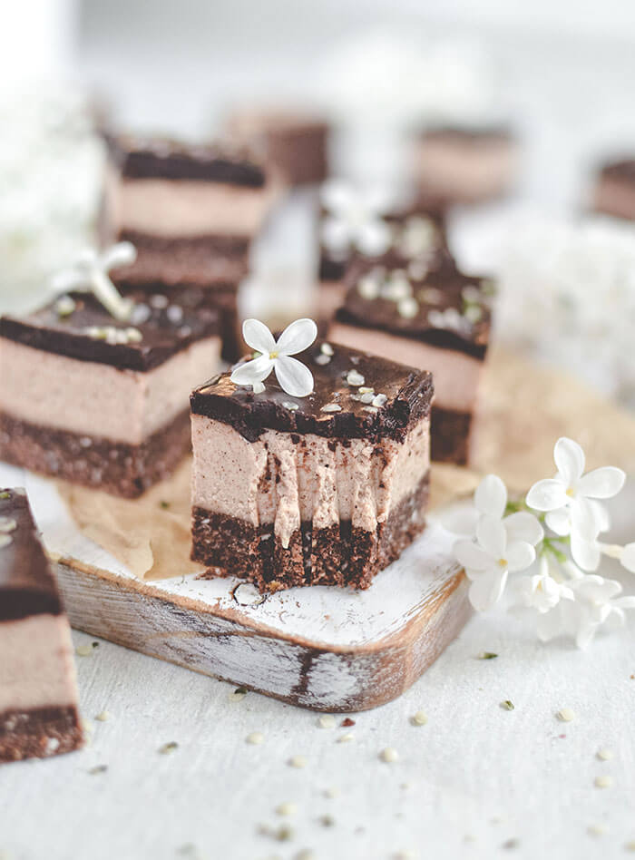
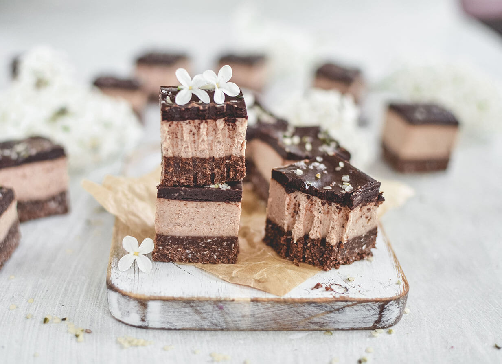
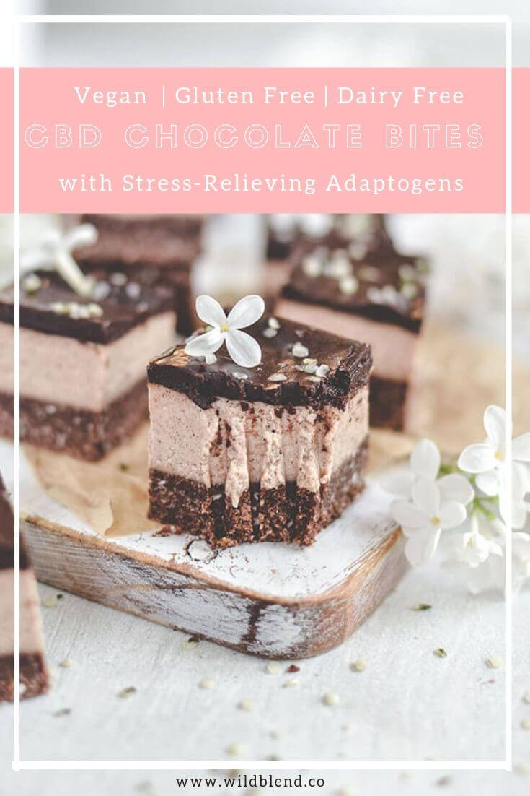

Delicate yet satisfying, these adaptogenic CBD chocolate bites will make anyone’s heart happy. The heavenly match of cacao and **CBD oil** makes this treat extra special. It’s hard to believe that the delicious creaminess is stress-reducing, hormone soothing and calming. These dessert squares may look too good to be _healthy_, but you’ll be delighted to know that this recipe is 100% **Vegan\*\***\-friendly**. I've  also added a **Paleo** and **Keto-friendly\*\* adaptation to the recipe notes.

This recipe is a beginner 'baker’s' delight. There are only **3 easy steps**, giving you the chance to catch your breath between each. Also, each layer uses the same method: put all the ingredients into the blender and mix. Even so, this is far from a boring dessert.  You’ll discover a layering of delicate flavours and textures.  The crunch of the base contrasts beautifully with the smooth creamy layers. The Maca powder in the base and the cream adds an unexpected mildly nutty taste with a hint of butterscotch.

\[thrive_leads id='1525'\]

Begin with the base layer. Make sure the press-in base is evenly distributed so that each bite gets an equal amount of the wholesome crust. I do this by pressing the sticky cookie dough into the baking dish with a drinking glass or straight-sided measuring cup. Cover the base evenly with the cream, and smooth with a spatula. Set aside in the freezer for 4-6 hours, and take a well-earned rest. The next day, combine the chocolate ingredients and pour over the set layers. For a sophisticated finish smooth with a spatula. Sprinkle with sea salt and hemp hearts.

Allow to set for half an hour in the fridge. Finally, cut into bite-size squares and serve, happy in the knowledge that this melt-in-the-mouth goodness will not only soothe and comfort, but the Maca and Ashwagandha will also empower your body to adapt to stress. This is an excellent dessert choice if you’re planning a dinner party because you can prepare most of it the day before. It will need 4-6 hours for the bottom 2 layers to set, and a further 30 minutes in the fridge once you’ve poured on the chocolate.

If you love raw chocolate treats, you might also like my [Dark Chocolate Pistachio Pralines](https://www.wildblend.co/dark-chocolate-pistachio-pralines/).

[Print](http://localhost:10003/adaptogenic-cbd-chocolate-bites/print/3193/)

## Adaptogenic CBD Chocolate Bites

Ease the stress of the day away with these calming, bite-sized Adaptogenic CBD Chocolate Bites infused with Maca and Ashwaghanda.

- **Author:** Zoe Lyons

### Ingredients

Scale 1x2x3x

**Base layer:**

- 1/3 cup Medjool dates, pitted (5 dates)
- 1/4 cup coconut oil, melted
- 2 Tbsp maple syrup (Swap for monk fruit, erythritol or Stevia for Keto)
- 2 droppers CBD oil
- 1 cup shredded coconut, ground into rough flour
- ¾ cup gluten-free oat flour\* (Swap for almond flour for Paleo & Keto)
- 1/4 cup cacao powder
- 1 tsp Maca powder
- Pinch sea salt

\***Note**: I make the oat flour by processing gluten-free oats in my Vitamix on high for 60 seconds.

**Cream layer:**

- ¾ cup full-fat coconut cream
- 1/3 cup pecan butter
- 1 Tbsp cacao butter, melted (5 cacao butter buttons)
- 2 Tbsp maple syrup (Swap for monk fruit, erythritol or Stevia for Keto)
- 1 tsp Maca powder
- 1 tsp [Ashwaghanda](https://moonjuice.com/products/ashwagandha) powder
- 2–3 droppers CBD oil
- 1 tsp vanilla extract
- ¼ tsp cinnamon

**Tip:** Feel free to add Cordyceps mushroom or any other adaptogen to these chocolate bites.

**Chocolate Layer::**

- 3 Tbsp cacao powder
- 3 Tbsp melted coconut oil
- 1 dropper CBD oil
- 2.5 Tbsp maple syrup (Swap for monk fruit, erythritol or Stevia for Keto)
- 1 Tbsp coconut milk
- ¼ tsp sea salt (to decorate)
- ¼ tsp hemp hearts (to decorate)

**Note:** These CBD chocolate bites can easily be made **Paleo & Ketogenic** by swapping the oat flour with almond flour and switching the maple syrup for monk fruit, erythritol or Stevia.

### Instructions

1. To make the base, add all ingredients to a processor and pulse until a sticky cookie dough forms.
2. Press into lined square baking dish and set aside.
3. To make the cream layer, add all ingredients to a high-speed blender and process until smooth and creamy.
4. Pour cream over base and smooth with a spatula.
5. Cover and place in freezer for 4-6 hours or overnight to set.
6. Once set, remove from freezer and make the chocolate layer.
7. For the chocolate layer, add coconut oil, CBD oil (if using), maple syrup, coconut milk and cacao powder to a high-speed blender and blend until smooth and creamy.
8. Pour chocolate layer on top of cream layer and smooth with a spatula.
9. Sprinkle with sea salt and hemp hearts.
10. Cover and place in fridge to set for 30 minutes.
11. Once set, slice into squares and enjoy!

### Notes

**Tip:** Store in airtight container in the fridge or freezer.

### Did you make this recipe?

Share a photo and tag us — we can't wait to see what you've made!

