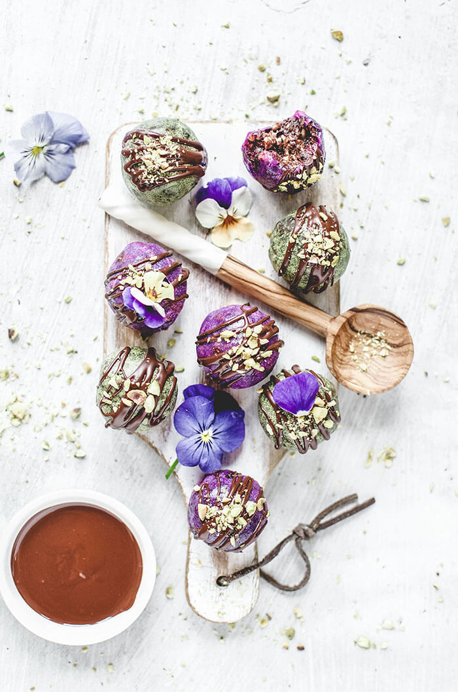

Just one Adaptogenic Moon Ball can make the world of difference when you’re feeling stressed out. This recipe is packed with ingredients that reduce anxiety.

One of these is the [Four Sigmatic Lion’s Mane Elixir](https://international.foursigmatic.com/products/instant-lions-mane). This all-natural brain booster has no side effects. The Lion’s Mane is known to protect against dementia, reduce symptoms of anxiety and depression and help lower the risk of heart disease. The elixir also contains Rhodiola Rosea, well known to help decrease stress, fight fatigue, improve brain function, and reduce depression.

So, start by making the dough for your Adaptogenic Moon Balls by thoroughly mixing the ingredients in a high-speed food processor. This recipe makes about 8 balls. Place them on a parchment paper-lined tray and freeze until firm.

Make the glaze by whisking all the ingredients except the matcha and pitaya. When the mixture is smooth divide it into two separate bowls. Add the matcha powder to one for a lovely green and the pitaya powder to the other for a pretty pink glaze.

\[thrive\_leads id='1525'\]

Anxiety takes a lot of joy out of life, don’t you think? Many of us worry that we won’t be able to do something new. If this is the first time you’re making these Adaptogenic Moon Balls, you might think that you’ll battle to get the glaze coating just right, but you’ll find that this isn’t difficult at all.

There’s no clever trick to learn. Simply dunk each ball into the glaze and move around until fully coated. Return them to your parchment-lined tray. The glaze should harden almost immediately. If it doesn’t, don’t panic. Just place the tray back into the freezer, and your moon balls will soon have a lovely glaze coat.

Your Adaptogenic Moon Balls will already look mouth-watering, but you can add even more temptation with a decoration of drizzled chocolate and a sprinkle of pistachios.

If you love adaptogens, you might also like my [Adaptogenic CBD Chocolate Bites](https://www.wildblend.co/adaptogenic-cbd-chocolate-bites/).

\[tasty-recipe id="4752"\]
