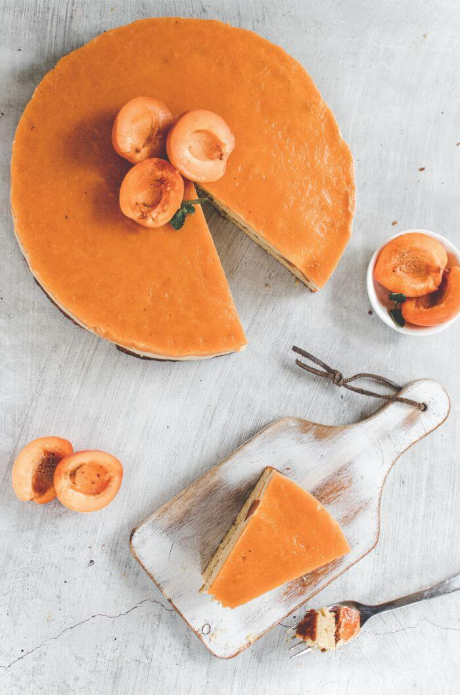
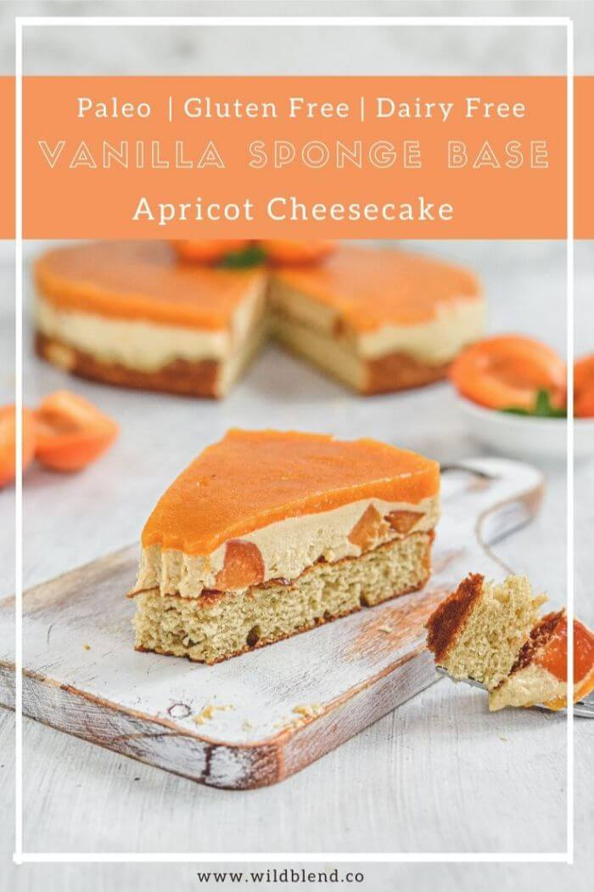

Summer in Australia wouldn’t be complete without the arrival of stone fruit season. The characteristic flavour and sweetness of apricots pairs beautifully with the delicate vanilla sponge base in this dairy-free cheesecake recipe.

The fluffy vanilla sponge will no doubt bring back memories of the old-fashioned cakes we used to enjoy at summer birthday parties when we were children. But, in this recipe, the vanilla sponge is transformed into the base of a light and juicy, sweet and creamy apricot cheesecake. Not many guests ever guess that this apricot cheesecake is actually both **gluten-** and **dairy-free**.

 

The base is baked, so it is best to make it first. This will give it time to cool before layering the cream on top. The sponge itself doesn’t have apricots, but don’t let this fool you. The Medjool dates and maple syrup make it sweet and gentle. You’ll find that their flavors marry very nicely with the cream and jelly.

\[thrive\_leads id='1525'\]

#### How to Make It

Combine all the ingredients in your blender, and bake at 350°F for 15 – 17 minutes or until a wooden skewer comes out clean. Let it cool in the form baking tin.

The cheesecake layer is no-bake. Make extra sure that the cashew nuts are fully incorporated. Only stop your high-speed blending once the mixture is smooth and creamy. Spread this cream evenly on top of the sponge base and place it in the freezer to set. Of course, if you really love a little more texture, you can add diced apricots between the sponge and the cream.

The top layer of this apricot cheesecake is all-glamour and gloss and gives a brilliant first impression. Start the apricot jelly with 2 tablespoons of water and 1 teaspoon of gelatine in a small dish. Set aside and allow it to bloom whilst you soften the apricots on the stove.

Once your apricot and water mixture has come to the boil, turn the heat to simmer. When the apricots are soft, discard the water and blend the fruit until it is smooth.

Return the apricot puree to the pot, add the bloomed gelatine and simmer for just one minute. Pour this over the cream layer. You’ll now have a cheery topping on your apricot cheesecake. Cover and place in the fridge for 20 minutes before serving.

I hope you’re as pleased with this apricot cheesecake as I am. It’s the classic cheesecake with a serious upgrade. The bright apricot glaze always brings summer sunshine to my table and a happy smile to my guests. What could be better?

**Tips:**

- The quantities of this apricot cheesecake recipe make one 6-inch or 15cm springform cake pan.
- The best way to bloom the gelatine is to sprinkle the powder evenly on top of a little cold water. As it absorbs the water it will swell in size.
- You can swap the gelatine for agar to create a vegan jelly.
- Keep an eye on the simmering apricots. Fruit tends to scald quickly, and nobody likes to have to make something twice just because you looked away for a minute.

If you like this dairy-free apricot cheesecake, you'll also like my [Brownie Bottom Raspberry Cheesecake](https://www.wildblend.co/brownie-bottom-raspberry-cheesecake/).

\[tasty-recipe id="9331"\]
