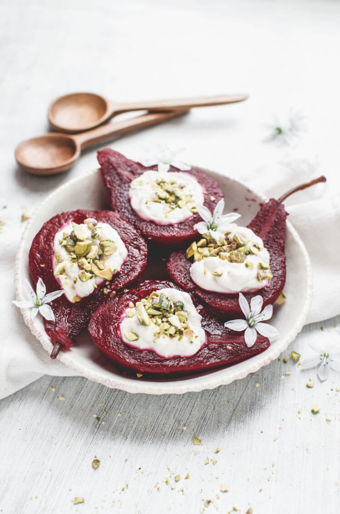
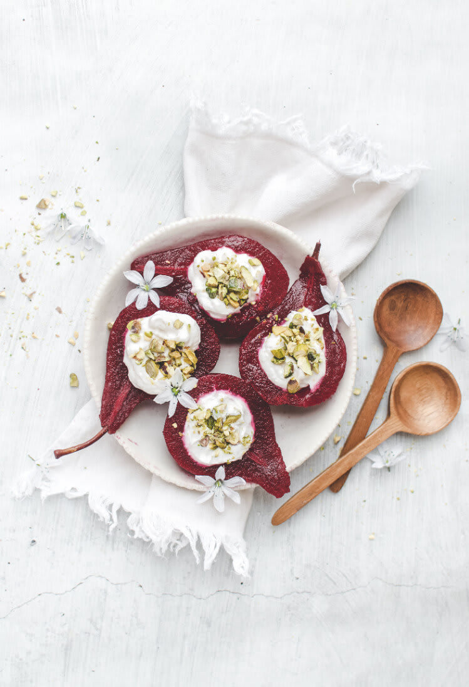
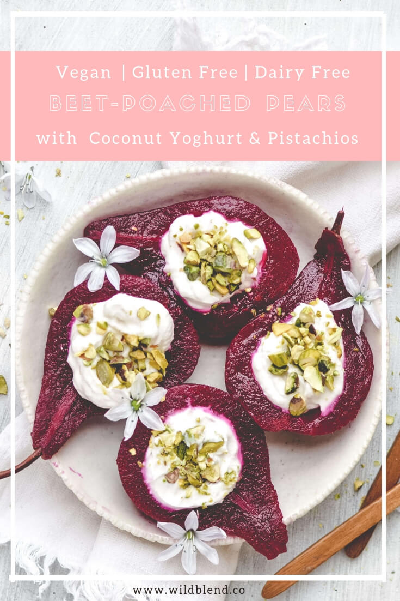

These beet-poached pears look fancy but come together easily. Poached with beets, maple syrup and cinnamon, they’re also 100% **vegan** and naturally **gluten-free**.

As far as flavour goes, the beet doesn't give the pears a strong taste. You’ll notice subtle earthy notes and a nice overall balance with hints of cinnamon and maple. It’s a is a very light and simple dessert that isn't overly sweet.

\[thrive\_leads id="1525"\]

Start off by combining the diced beets, maple syrup, cinnamon sticks and water in a large skillet, then bring to a boil. Reduce the heat and add in the peeled pears, fully submerging them under the liquid. Simmer, turning occasionally, until pears are tender and liquid is syrupy, 25 to 35 minutes.

To make the topping, stir together coconut yoghurt and maple syrup. Scoop out the cores of the pear halves to create a cavity for the yoghurt using an ice cream scoop or spoon and fill with a generous helping of coconut yoghurt. Then top with crushed pistachios or granola. Serve warm and enjoy!

Tip: Red beets tend to stain your hands, so when peeling and cutting them consider wearing plastic gloves.

\[tasty-recipe id="2433"\]
