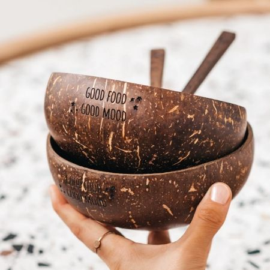

Christmas is a time of waste and excess. Each year, mountains of wrapping paper are going straight into the bin and leftover food platters are piling up in the fridge. According to figures from the Australian Retailers Association, Australians will spend $53 billion over the Christmas period this year.

These 10 green Christmas gift ideas will help you discover how you can make a difference by becoming a more sustainable consumer. This green Christmas gift guide only contains products we love and use. From our trusty sauerkraut crock to our latest passion: DIY mushroom growing kits — every single one of these products will leave you feeling better about gift-giving and bring us one step closer to a more sustainable planet.

So, without further ado, here are our 10 favourite green Christmas gift ideas:

## [**Kombucha Home** **Brewing Kit**](https://t.cfjump.com/52650/t/14846?Url=https%3a%2f%2fwww.biome.com.au%2fdiy-kits%2f26179-buchi-home-brew-kit-kombucha.html)

You'll never buy sugary, over-priced kombucha from a store once you've tried making your own and discovered how easy and delicious it is. Make your own raw, organic Kombucha at home with this DIY kit from Buchi. This kit contains everything you need to brew your very own certified organic, probiotic-rich Kombucha at home. Get it [here](https://t.cfjump.com/52650/t/14846?Url=https%3a%2f%2fwww.biome.com.au%2fdiy-kits%2f26179-buchi-home-brew-kit-kombucha.html).

 

## [**Coconut Bowls**](https://au.coconutbowls.com/collections/bundle-packs/products/coco-combo)

Made by nature, crafted by hand from wasted coconut shells and waste wood. Coconut bowls are perfect for smoothie bowls, breakfast bowls, salads, snacks and everything in between. You can also use them to create beautiful homemade soy candles or other crafty DIY projects.

**Discount:** Use code **WILDBLEND10** for 10% off across the entire store! Get it [here](https://au.coconutbowls.com/collections/bundle-packs/products/coco-combo).

 

## [**Microgreens** **Windowsill Kit**](https://t.cfjump.com/52650/t/14846?Url=https%3a%2f%2fwww.biome.com.au%2fheirloom-seeds-australia%2f18954-urbangreens-microgreens-windowsill-kit.html)

This is a super cute sprouting kit packed with everything you need to grow your own healthy, nutritious microgreens. Perfect if you don't have a garden but would love to grow your own microgreens to supercharge your smoothies and salads. Plop it on your windowsill and turn your kitchen into a green haven! Get it [here](https://t.cfjump.com/52650/t/14846?Url=https%3a%2f%2fwww.biome.com.au%2fheirloom-seeds-australia%2f18954-urbangreens-microgreens-windowsill-kit.html).

 

## **[Reusable Coffee Cups by Pottery For The Planet](https://www.potteryfortheplanet.com/collections/store)**

Australians drink SO MUCH coffee⁠—we need to stop using single-use coffee cups right now!  Save our planet by saying no to single-use coffee cups and switching them out for these beautiful cups from Pottery For the Planet. We use ours every day and have even bought some extras to use as cups at home because their glazes are so pretty. Get it [here](https://www.potteryfortheplanet.com/collections/store).

 

## **[Stasher Bags](https://t.cfjump.com/52650/t/14846?Url=https%3a%2f%2fwww.biome.com.au%2freusable-food-pouches%2f20351-stasher-square-raspberry-450ml-816990012776.html)**

There is no longer a need for single-use sandwich bags. Stasher bags are a reusable storage solution ideal for the kitchen, travel, school lunches, baby items, phones, makeup and more. We mostly use them in place of glad wrap to store cut avocado, lemons, and onions. I've also used them for travelling to store various items in them. Get it [here](https://t.cfjump.com/52650/t/14846?Url=https%3a%2f%2fwww.biome.com.au%2freusable-food-pouches%2f20351-stasher-square-raspberry-450ml-816990012776.html).

 

## [**DIY Mushroom Grow Kit**](https://urbanspore.com.au/product-category/ready-to-grow-kits/)

Grow your own gourmet mushrooms at home with this Urban Spore mushroom grow kit. We are obsessed with mushrooms and have recently discovered the joys of growing your own mushrooms at home. I'm taking edible, culinary mushrooms, my friends, such as oyster, Shiitake and Lion's Mane. It is fun, it is fascinating and the whole family will enjoy this educational gift. Get it [here](https://urbanspore.com.au/product-category/ready-to-grow-kits/).

 

## **[Reusable Silicone Food Covers](https://t.cfjump.com/52650/t/14846?Url=https%3a%2f%2fwww.biome.com.au%2freusable-food-wraps-covers%2f12304-lilypad-silicone-food-cover-medium-8-inch-20cm--815086010344.html)**

Our house is pretty much single-use plastic-free. We've gotten rid of glad wrap, sandwich bags, etc. There is no need for throwaway plastic wrap with these brilliantly designed reusable lily pad silicone covers. Whenever we store leftover food in the fridge that we don't put in a container, we simply use one of these silicone lids and put it in the fridge. Super easy, you can thank me later. Get it [here](https://t.cfjump.com/52650/t/14846?Url=https%3a%2f%2fwww.biome.com.au%2freusable-food-wraps-covers%2f12304-lilypad-silicone-food-cover-medium-8-inch-20cm--815086010344.html).

 

## [**DIY Whipped Body Butter**](https://www.wildblend.co/whipped-body-butter/)

Homemade gifts are the best because they are created with love. You can easily create homemade, toxin-free luscious body butter for friends and family with this simple DIY recipe. This whipped body butter literally feels like whipped cream—it melts on your skin, is decadently moisturizing and much better-for-you than store-bought creams. Get the recipe [here](https://www.wildblend.co/whipped-body-butter/).

 

## **[Sauerkraut Fermenting Pot](https://t.cfjump.com/52650/t/14846?Url=https%3a%2f%2fwww.biome.com.au%2ffermented-produce%2f14070-mad-millie-fermenting-crock-9421025512797.html%3fsearch_query%3dfermenting%2520%26fast_search%3dfs)**

If you haven't noticed already, we love making everything from scratch in our household. Sauerkraut is no different. It's SO much cheaper and surprisingly simple to make at home. My husband and I have received this Mad Millie fermenting pot as a gift a few Christmases back and have been using it ever since. Make your own gut-healing sauerkraut and kimchi in no time with this bad boy. Get it [here](https://t.cfjump.com/52650/t/14846?Url=https%3a%2f%2fwww.biome.com.au%2ffermented-produce%2f14070-mad-millie-fermenting-crock-9421025512797.html%3fsearch_query%3dfermenting%2520%26fast_search%3dfs).

 

## [**Leaf Supply Guide to Creating Your Indoor Jungle**](https://www.booktopia.com.au/leaf-supply-guide-to-creating-your-indoor-jungle-lauren-camilleri/book/9781925811254.html?source=pla&gclid=EAIaIQobChMI57ywt8GV5gIVmB0rCh3lmwIwEAQYASABEgIbJvD_BwE)

Plants are life and indoor plants are not only an obsession of mine but have taken the Internet by a storm. The number of **#plantmum** accounts that have popped up on Instagram in the last year has skyrocketed. This book by Leaf Supply is a luxurious guide to creating the very densest of jungles in your living room. It's time to finally turn that thumb green! Get it [here](https://www.booktopia.com.au/leaf-supply-guide-to-creating-your-indoor-jungle-lauren-camilleri/book/9781925811254.html?source=pla&gclid=EAIaIQobChMI57ywt8GV5gIVmB0rCh3lmwIwEAQYASABEgIbJvD_BwE).

There you have it, I hope you liked being inspired to make a shift to a greener Christmas this year and find some climate-conscious choices in our green Christmas gift ideas list.

_**Merry Christmas!**_

_This post contains some affiliate links, meaning, at no additional cost to you, if you click through and make a purchase, I may receive a commission._
