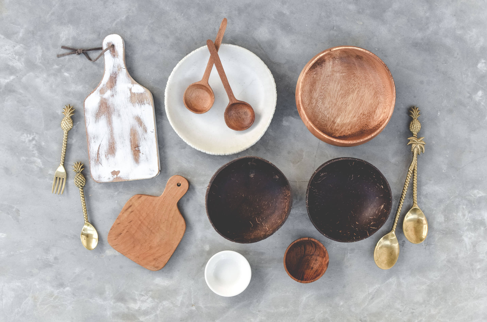
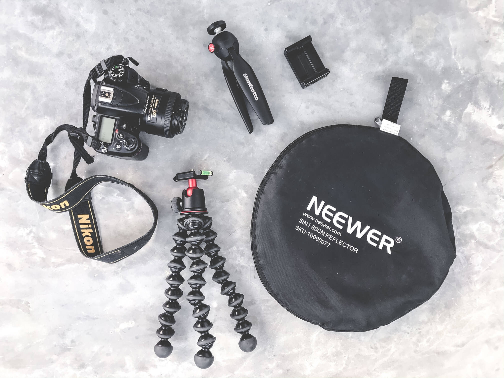
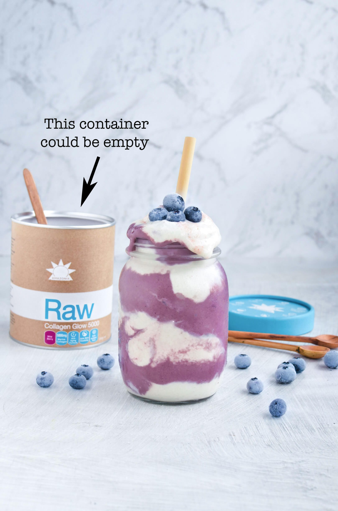
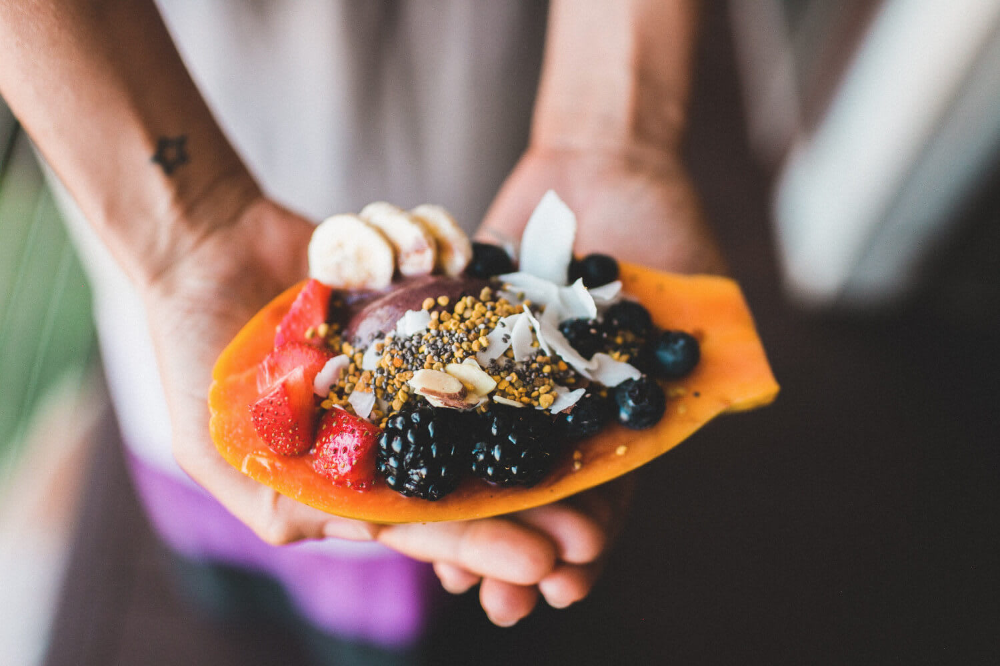
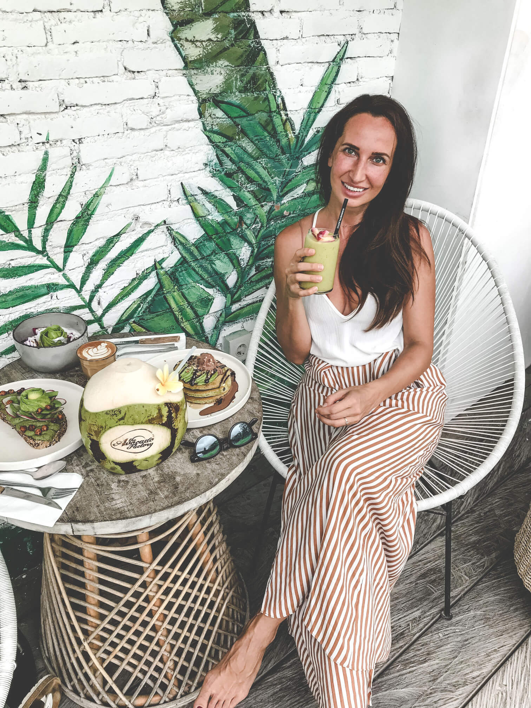
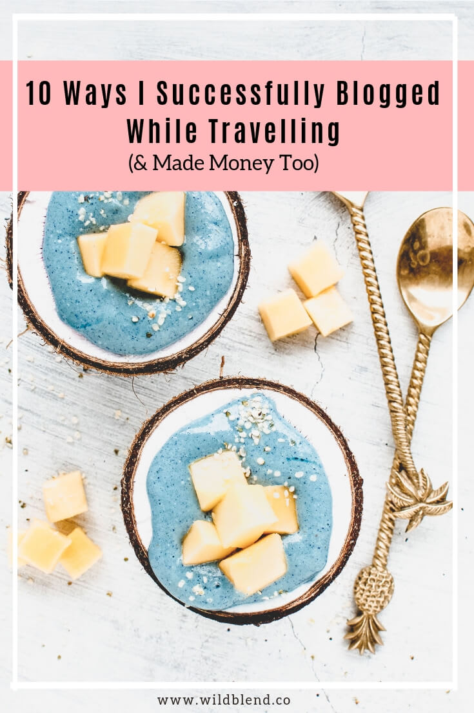

My husband and I travel a lot. One could say, we spend more time on the road than our home Australia. We both have remote jobs which give us the ability to work online from pretty much anywhere with a strong WiFi connection. We've been to the USA, Bali, Austria, Sri Lanka, Vanuatu, China, and many more countries in the last few years. Currently, we are on a trip to Sri Lanka and Morocco. I wanted to share 10 ways how I successfully continue to blog while travelling.

## #1: Bring Portable Backdrops

The most important thing is the consistency of your blog and Instagram feed. You don’t want to leave backdrops up to chance. Most hotels and Airbnbs won’t have a suitable photography backdrop (kitchen countertop or table) that matches the vibe of your photos. If you have a certain style and don’t want to mix up the feel of your blog by shooting on random backdrops, I suggest packing light-weight vinyl backdrops that won’t weigh down your luggage. You can roll them up, easily fit them into your suitcase and take them anywhere. My favourite ones are this [grey concrete floor](https://svpplyco.com/backdrops/concrete-floor-background/?ref=70) and this [faux grey marble backdrop](https://svpplyco.com/backdrops/grey-marble-backdrop-90-60/?ref=70) from a company called [Svpply Co](https://svpplyco.com/?ref=70). I use them for most of my shots and take them on the road with me anywhere I go. I’ve written a whole blog post about [The Best Food Photography Backdrops for Bloggers](https://www.wildblend.co/best-food-photography-backdrops/) if you’re interested in learning more about backdrops.

https://svpplyco.com/backdrops/concrete-floor-background/?ref=70 https://svpplyco.com/backdrops/grey-marble-backdrop-90-60/?ref=70 https://svpplyco.com/backdrops/moody-concrete-90x60cm/?ref=70

## #2: Pack Your Favourite Props

Props are just as important as backdrops when it comes to the visual appeal of your feed. I personally don’t like to rely on [Airbnb](http://www.airbnb.com.au/r/zraissakis) kitchens because you never know how well stocked they are. Some might have cute ceramics but mostly you’ll find cheap plates and bowls which don’t look nice in photos. Instead, pack a couple of your favourite spoons, one or two bowls,and some accessories you can’t live without. [C](https://eu.coconutbowls.com/products/original-coconut-bowl)[oconut bowls](https://www.coconutbowls.com/products/original-coconut-bowl) are very lightweight and perfect to transport because they can’t break (Code WILDBLEND10 will give 10% off across the entire [store](https://eu.coconutbowls.com/collections/shop-collection)). Minimise it to the essentials or you’ll end up with zero space for clothes in your suitcase (the struggle). See my absolute must-have photography props below.

## #3: Bring a Reflector and Diffuser

The most beautiful and natural looking food photos are usually shot with natural light. A simple reflector, like a piece of white cardboard, is an excellent way of bouncing light onto your food to minimise shadows. I travel with a cheap $2 cardboard, that is lightweight and can be folded. It fits in my suitcase and doesn’t weight me down. Also, be sure to bring a diffuser, to soften harsh direct light if necessary. I use this portable [Neewer reflector and diffuser](https://amzn.to/2Fdkx1d) for travelling. It's collapsible and also super lightweight.

## #4: Pack a Travel Tripod

Some pictures require a tripod but most proper tripods are bulky and heavy. My [Manfrotto studio tripod](https://amzn.to/2C4Oe0k) is a beast and impossible to travel with. Instead, I take this lightweight [Joby Gorilla tripod](https://amzn.to/2TBIHWn) on all my trips because it fits into my suitcase, has flexible legs and a ball head which allows for portrait shots. Be sure to get the 5k premium aluminum version, so it's strong enough to hold your DSLR as well as your iPhone.

## #5: Bring Empty Product Packaging

This is were the money comes in. If you need to continue working on important collaborations while you’re on the road, pack empty product packaging. Bringing tubs of product like protein powder can be extremely heavy and inconvenient to travel with. My tip is to empty out the containers (satchel, box, tub—whatever you are promoting) and use the empty container in product shots without having to carry full packages around. This will only work occasionally as some products can't be unpacked or emptied out, but it's a handy trick for bulkier items. Told you, it's 100% possible to continue to blog while travelling and make money.

## #6: Schedule Ahead

Depending on how much time you have to prepare your trip, be sure to create content in advance and share it while you're on the road. If you can, spend a couple of days in the kitchen cooking and creating recipes. I like to cook, style and shoot my recipes in advance and then edit the photos and write the actual post when I'm already travelling. However, this is the ideal scenario. If you have a full-time job and blogging is only your side hustle, you probably don't have the time to create content ahead of time. I usually only manage to prepare a few recipes before we go on a trip because life gets in the way (lol). High five to you, if you are a blogging superhero who prepares full blog post (written post and edited images) ahead of time.

## #7: Write and Edit on the Plane and at Airports

You've cooked and photographed all your recipes at home in preparation of your big trip. Well done! Now it's time to edit them. Editing photos at the airport or on the plane is the best way to kill time. No WiFi, no problem! Trust me, time will pass very quickly if you have a big bunch of images to edit, resize, and compress before you upload them to your blog. Airports are also an excellent place to write blog posts. I love the busy environment at airports and always feel inspired to write faster than I would sitting by myself in my apartment.

\[thrive\_leads id='1525'\]

## #8: Book Accommodation with Access to a Kitchen

When booking Airbnb’s we always try to find apartments or rooms with access to a kitchen. Not only can you cook your own healthy food and don’t have to eat out all the time but it also allows you to work. Once you've shared all your prepared content, it's time to create new recipes. This is the time when having access to a kitchen pays off. You can go to the local markets, buy fresh produce and get creative. Dish up your holiday creations in one of your packed bowls and start taking pictures on your vinyl backdrop.

## #9: Draw Inspiration at Local Markets

Travelling is exciting for all senses—especially for our taste buds! Never miss a chance to check out local markets. It's the perfect opportunity to discover exotic fruit and veg and get inspired to be creative in your own kitchen. Every time I am in Bali I try and go to the [Samadi Sunday Market](https://www.samadibali.com/organic-sunday-market/) in Canggu. Local farmers sell their chemical free, healthy, and fresh produce and there's also a bunch of artisan stalls with delicious food. Yum!

## #10: Seek Good WiFi or Stay at Coworking Spaces

Good WiFi is the bane of my existence every single time I travel. My husband and I both have remote jobs and need the Internet for survival (lol). A lot of places, especially in Asia, have dodgy WiFi that will make you go bananas. Don't pull your hair out over shitty internet. Instead, research ahead of time and seek places with great WiFi. Coworking places are generally your best bet and most often a fantastic place to meet interesting freelancers and maybe even pick up a new client. [Coworker.com](https://www.coworker.com/) is a great resource to research coworking places around the world.

## Bonus Tip: Branch Out of Food Photography

Travelling is the perfect opportunity to start taking pictures of other things than food. Adding more personalised shots to your Instagram feed humanizes your account and makes it more relatable. You can start by taking cute photos of yourself trying local foods, sipping tropical smoothies or shopping at the markets. Ideally, you have travel company who can help you with those candid travel shots. Otherwise, set up your tripod and put your phone on a timer (you got this girl)—that's what I do most of the times because my husband dislikes taking my picture.

## Conclusion

Still worried you'll lose all your followers (or worse, clients) while you travel? Don't be, if you follow these ten steps, you'll successfully be able continue to blog & make money while travelling. The three most important elements for me are always my portable backdrops, photography props and great WiFi. Everything else is a matter of organisation and consistency. Please feel free to leave a comment below if you have any questions.

Are you a frequent traveller and have first hand tips on blogging on the road? Please leave a comment below and share your knowledge!

* * *

This post contains affiliate links, meaning, at no additional cost to you, if you click through and make a purchase, I may receive a commission.

[Follow my blog with Bloglovin](https://www.bloglovin.com/blog/19219375/?claim=rzjjk8emsrq)
