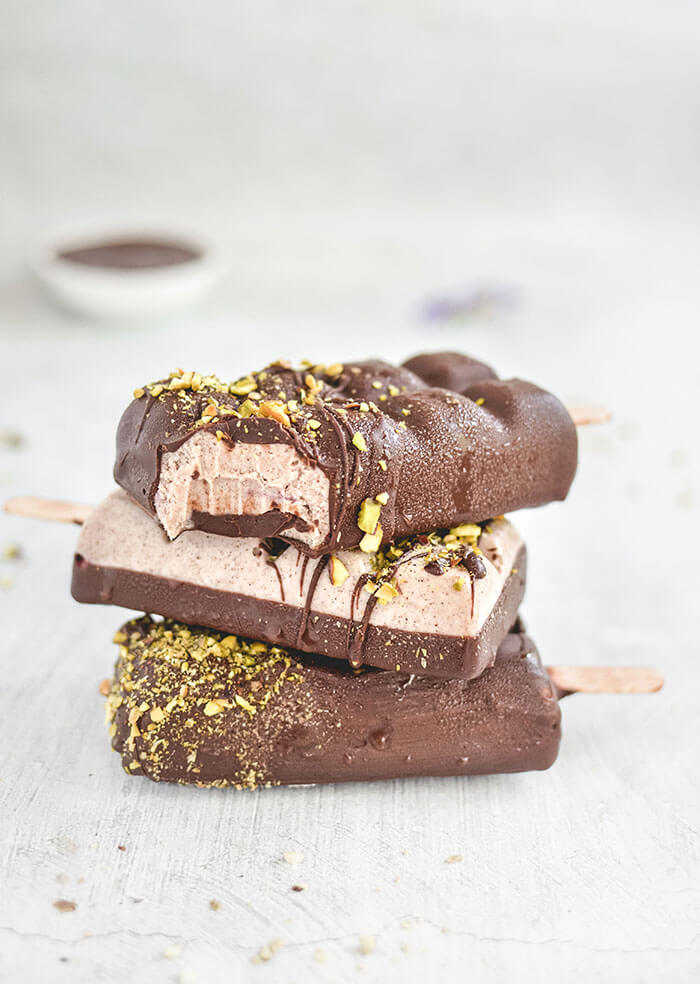
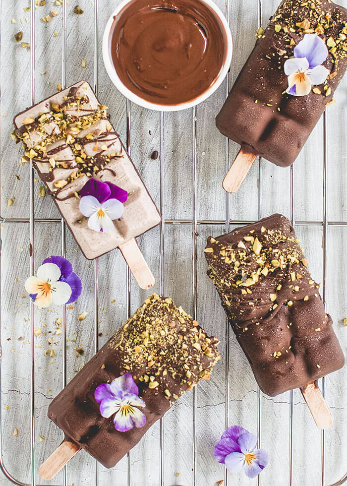
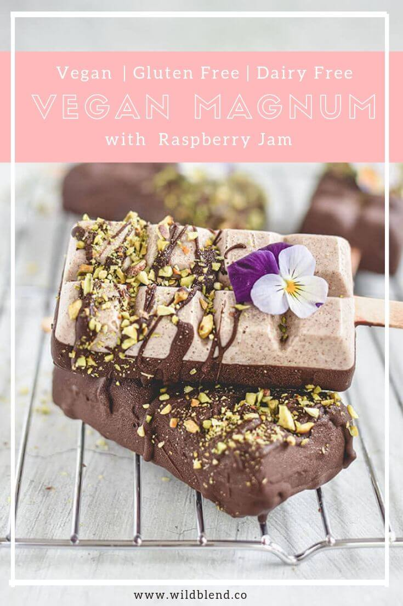

These dairy-free, chocolate-coated ice cream bars are healthy right through to the raspberry jam centre. My whole family loves these Vegan Berry Bliss Magnums so much that I make them regularly.  I have a confession though. It isn’t as hard as you think to get perfectly shaped, equal sized magnums — I use a simple silicone mould. Choose a non-stick [ice cream](https://www.amazon.com/gp/product/B005WQ4P2Q/ref=ppx_yo_dt_b_asin_title_o04_s01?ie=UTF8&psc=1) [mould](https://www.amazon.com/gp/product/B005WQ4P2Q/ref=ppx_yo_dt_b_asin_title_o04_s01?ie=UTF8&psc=1) that allows your frozen bars to pop out without a fuss, and is also easy to clean.

Start with the cream layer, because as it freezes you I have the time to make the raspberry jam for the sweet surprise in the middle. The secret to making this smooth and creamy filling is to mix the cashew nuts, maple syrup, pecan butter and coconut milk in a high-speed blender. This way there will be no unwelcome bits in your Vegan Berry Bliss Magnums. When you have filled your ice cream moulds half-way (this takes about a tablespoon and a half of cream), place them in the freezer to set and begin on the raspberry jam.

\[thrive\_leads id='1525'\]

Take your time when it comes to jam because the sticky mixture tends to burn if heated too quickly. When you have them stored in your freezer, preparing tart raspberry treats isn’t limited by the seasons.  Don’t be reluctant to use frozen fruit.  Freezing is an excellent way of preserving the nutrients.

These Vegan Berry Bliss Magnums are not complete without a chocolate coating.  Melt chocolate chips with coconut oil in a double boiler. You’ll get an elegant, smooth and inviting finish if you dip the bar into the chocolate rather than spooning it over. Drizzle with crushed pistachios for extra pizzazz.

If you love Vegan ice cream, you might also like my [Mango Pitaya Ombré Crunchsicles](https://www.wildblend.co/ombre-crunchsicles/).

\[tasty-recipe id="3243"\]
