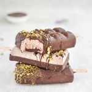

These dairy-free, chocolate-coated ice cream bars are healthy right through to the raspberry jam centre. My whole family loves these Vegan Berry Bliss Magnums so much that I make them regularly.  I have a confession though. It isn’t as hard as you think to get perfectly shaped, equal sized magnums — I use a simple silicone mould. Choose a non-stick [ice cream](https://www.amazon.com/gp/product/B005WQ4P2Q/ref=ppx_yo_dt_b_asin_title_o04_s01?ie=UTF8&psc=1) [mould](https://www.amazon.com/gp/product/B005WQ4P2Q/ref=ppx_yo_dt_b_asin_title_o04_s01?ie=UTF8&psc=1) that allows your frozen bars to pop out without a fuss, and is also easy to clean.

Start with the cream layer, because as it freezes you I have the time to make the raspberry jam for the sweet surprise in the middle. The secret to making this smooth and creamy filling is to mix the cashew nuts, maple syrup, pecan butter and coconut milk in a high-speed blender. This way there will be no unwelcome bits in your Vegan Berry Bliss Magnums. When you have filled your ice cream moulds half-way (this takes about a tablespoon and a half of cream), place them in the freezer to set and begin on the raspberry jam.

\[thrive_leads id='1525'\]

Take your time when it comes to jam because the sticky mixture tends to burn if heated too quickly. When you have them stored in your freezer, preparing tart raspberry treats isn’t limited by the seasons.  Don’t be reluctant to use frozen fruit.  Freezing is an excellent way of preserving the nutrients.

These Vegan Berry Bliss Magnums are not complete without a chocolate coating.  Melt chocolate chips with coconut oil in a double boiler. You’ll get an elegant, smooth and inviting finish if you dip the bar into the chocolate rather than spooning it over. Drizzle with crushed pistachios for extra pizzazz.

If you love Vegan ice cream, you might also like my [Mango Pitaya Ombré Crunchsicles](https://www.wildblend.co/ombre-crunchsicles/).

[Print](http://localhost:10003/vegan-berry-bliss-magnums/print/3243/)

## Vegan Berry Bliss Magnums

These dairy-free, chocolate coated Berry Bliss Magnums are healthy right through to the raspberry jam centre.

- **Author:** Zoe Lyons
- **Yield:** 4 magnums 1x

### Ingredients

Scale 1x2x3x

**For the cream filling  
**

- 1 cup cashews, soaked
- 2 Tbsp maple syrup
- 1/3 cup pecan butter
- 1/3 cup coconut milk

**For the jam**

- 1 cup frozen raspberries
- 1 Tbsp maple syrup
- 1 Tbsp chia seeds

**For the chocolate coating**

- 1 cup dairy-free chocolate chips
- 2 Tbsp coconut oil

### Instructions

1. For the cream filling, add all ingredients to a high-speed blender and process on high until smooth and creamy. Fill your ice cream moulds half way. I used about 1.5 tablespoons of cream in my moulds and placed them in the freezer while I made the jam.
2. For the jam, add frozen raspberries and maple syrup to a small saucepan and heat over medium heat until the raspberries start to break down.
3. Add chia seeds, stir until well combined and turn off the heat. Set aside for 15 minutes or until cooled down.
4. Once jam has cooled down, add  roughly 1 tablespoon of jam to each mould.
5. Place back in the freezer to set and cool down.
6. Once set, add 1.5 tablespoons of remaining cream to the moulds and spread evenly with a spatula.
7. Set in freezer for 4 hours or overnight.
8. For the chocolate coating, melt chocolate chips with coconut oil in a double boiler.
9. De-mould your ice pops and dip them in chocolate.
10. Drizzle with crushed pistachios or your favourite nuts.
11. ENJOY!

### Did you make this recipe?

Share a photo and tag us — we can't wait to see what you've made!

