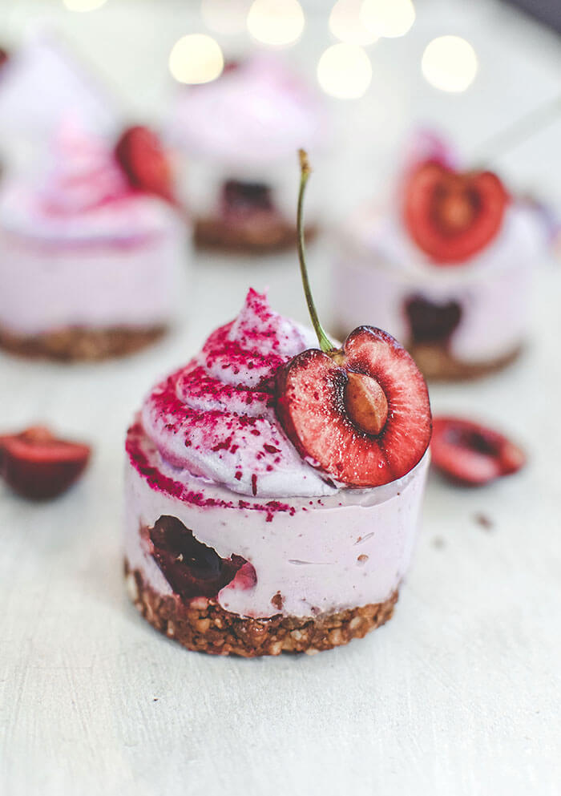
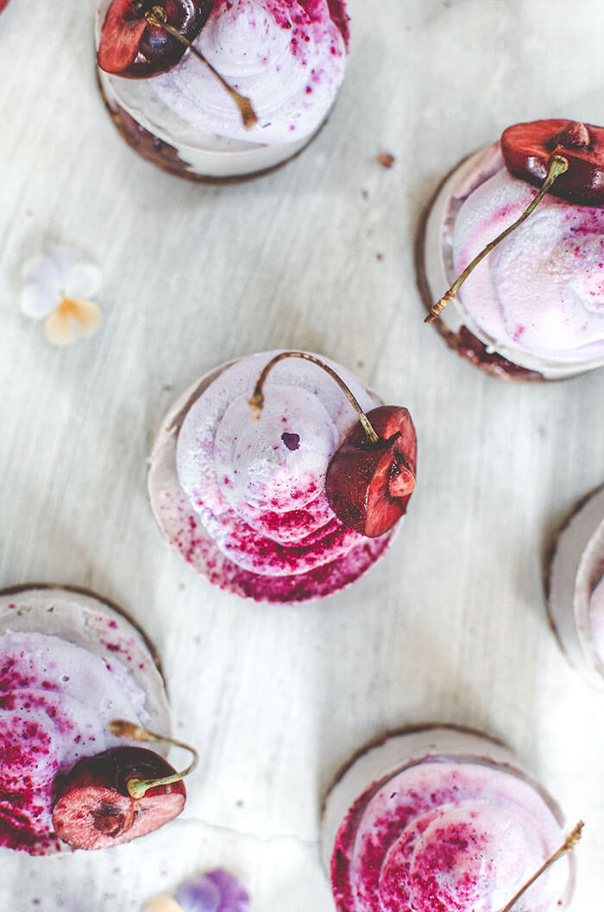
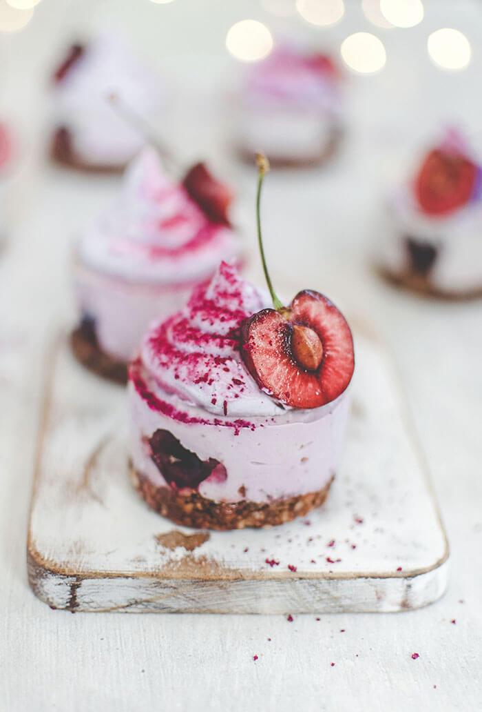
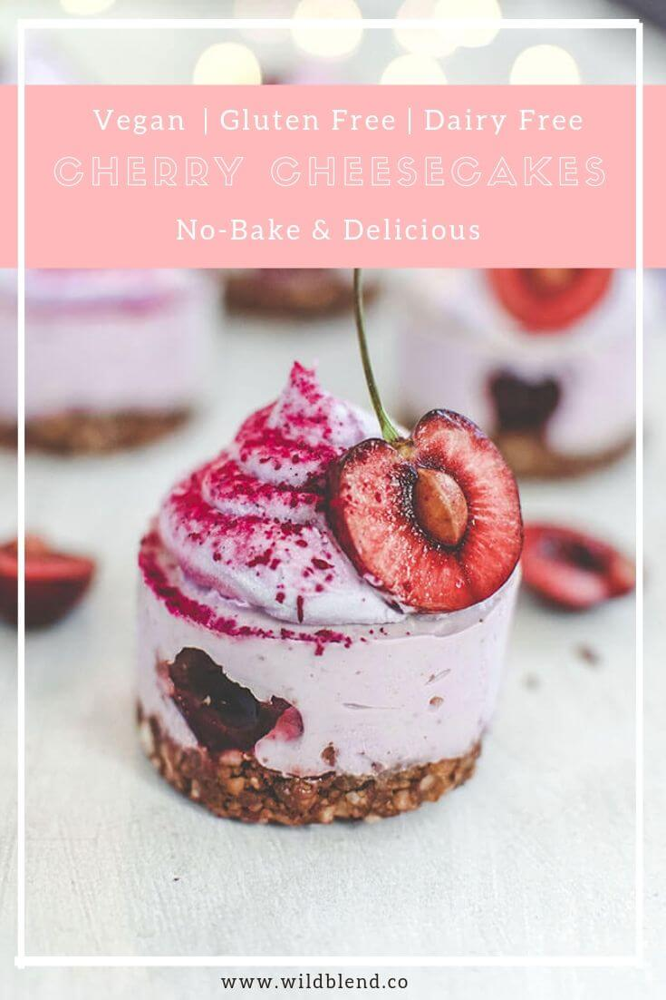

You’ll be delighted with this recipe from the moment you start. Made with only 7 ingredients, the mini vegan cherry cheesecakes are easy to prepare, **nutrient-dense** and rich in flavour. That’s pure pleasure from beginning to end. And the best part, you don't even have to turn on the oven!

When mixing the base ingredients in your food processor, the dates will make the dough nice and sticky and easy to press into your [mini silicone](https://www.amazon.com/gp/product/B0713T6ZFB/ref=ppx_yo_dt_b_asin_title_o06_s00?ie=UTF8&psc=1) moulds. Set aside until you’re ready to pour the cream over. For the cream, you want a much smoother texture. By processing in a high speed blender you’ll create a soft and creamy mixture, free of any pieces of cashews.

\[thrive\_leads id='1525'\]

Adding the cherries is always a sweet moment for me. **Cherry season** is one of my favourite times of the year. I love all summer fruit but cherries especially make me reminisce about my childhood. My brother and I would climb up our neighbour’s tree and eat cherries until our bellies hurt.

You might be tempted to add more **cherries**, not just because you love the juicy fruit’s distinctive taste but also the impressive health benefits. Cherries are a real power food, with everything from rich **antioxidant properties** through to a **low 22 on the Glycemic Index**. But it’s best to stick to a ½ cup so as not to overpower the delicate combination of fruit and nuts that make these mini vegan cherry cheesecakes so light and perfect for summer.

With 4 – 6 hours in the freezer to set, the vegan cherry cheesecakes are refreshing and cool. Perfect for hot summer’s afternoons when the 3pm munchies hit and you crave something sweet. The cherry on the top is that they are refined **sugar-free, dairy-free, gluten-free, no-bake**, **Paleo-** and **Vegan-friendly**. You can store them in an airtight container in the freezer for up to two weeks.

If you love raw cheesecake, you might also like my [No-Bake Avocado Lime Cheesecake](https://www.wildblend.co/avocado-lime-cheesecake/).

\[tasty-recipe id="3594"\]
